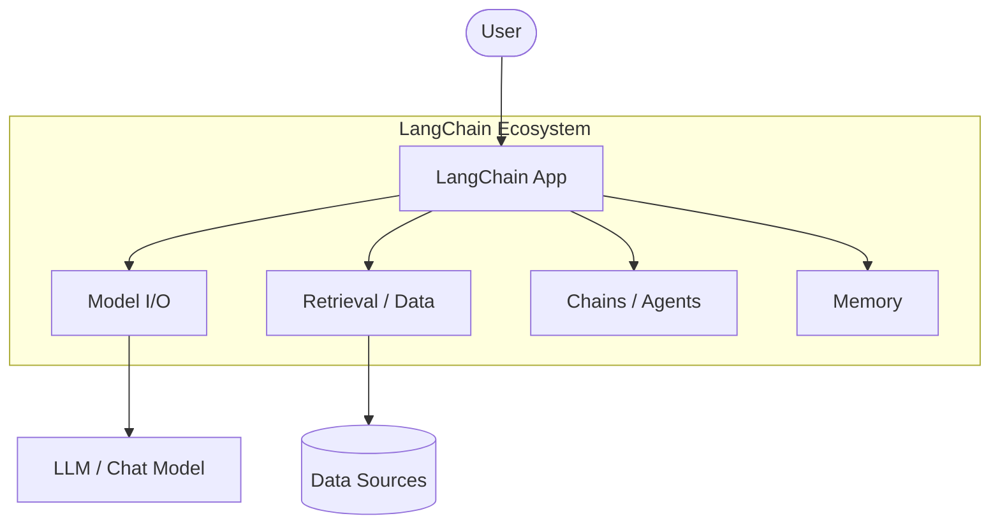
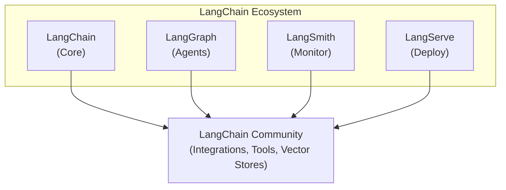
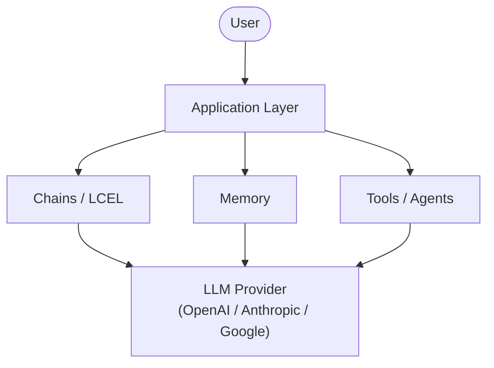

import {
  Aside,
  Tabs,
  TabItem,
  Card,
  CardGrid,
} from "@astrojs/starlight/components";

## Large Language Models (LLMs) คืออะไร?

**Large Language Models (LLMs)** คือโมเดล AI ขนาดใหญ่ที่ถูกฝึกมาจากข้อมูลข้อความจำนวนมหาศาล ทำให้สามารถเข้าใจและสร้างภาษามนุษย์ได้อย่างเป็นธรรมชาติ

### คุณสมบัติหลักของ LLMs

| คุณสมบัติ              | รายละเอียด                 |
| ---------------------- | -------------------------- |
| **Text Generation**    | สร้างข้อความ, บทความ, โค้ด |
| **Text Understanding** | เข้าใจและวิเคราะห์ข้อความ  |
| **Translation**        | แปลภาษาได้หลายภาษา         |
| **Summarization**      | สรุปเนื้อหายาวๆ ให้กระชับ  |
| **Reasoning**          | คิดวิเคราะห์และให้เหตุผล   |

<Aside type="note">
  LLMs ที่เป็นที่นิยม ได้แก่ GPT-4 (OpenAI), Claude (Anthropic), Gemini
  (Google), Llama (Meta) และ Mistral
</Aside>

---

## ทำไมต้อง LangChain?

เราต้องการจัดการ Prompts, เชื่อมต่อข้อมูล, สร้าง Workflow, และจัดการ Memory ซึ่ง LangChain ช่วยจัดการเรื่องเหล่านี้ให้ทั้งหมด



## LangChain Ecosystem

LangChain ไม่ได้มีแค่ Library Python แต่ยังมี:



<CardGrid>
  <Card title="🦜 LangChain Core" icon="puzzle">
    ไลบรารีหลักสำหรับ LLMs, Chains, Prompts, Memory
  </Card>
  <Card title="🕸️ LangGraph" icon="random">
    สร้าง Multi-Agent workflows ที่ซับซ้อน
  </Card>
  <Card title="🔍 LangSmith" icon="magnifier">
    Debug, Monitor, และ Evaluate LLM applications
  </Card>
  <Card title="🚀 LangServe" icon="rocket">
    Deploy LangChain chains เป็น REST API
  </Card>
</CardGrid>

---

## LangChain ทำอะไรได้บ้าง?

### 1. สร้าง Chatbot อัจฉริยะ

คำอธิบาย: โค้ดตัวอย่างด้านล่างแสดงวิธีใช้งานด้วย Python ตามหัวข้อนี้แบบทีละขั้นตอน

```python
from langchain_openai import ChatOpenAI
from langchain_core.messages import HumanMessage, SystemMessage

# สร้าง Chat Model
chat = ChatOpenAI(model="gpt-4o-mini")

# ส่งข้อความ
messages = [
    SystemMessage(content="คุณเป็นผู้ช่วยที่เป็นมิตร ตอบเป็นภาษาไทย"),
    HumanMessage(content="LangChain คืออะไร?")
]

response = chat.invoke(messages)
print(response.content)
```

### 2. สร้างระบบ Q&A จากเอกสาร (RAG)

คำอธิบาย: โค้ดตัวอย่างด้านล่างแสดงวิธีใช้งานด้วย Python ตามหัวข้อนี้แบบทีละขั้นตอน

```python
from langchain_community.document_loaders import PyPDFLoader
from langchain_openai import OpenAIEmbeddings
from langchain_community.vectorstores import Chroma

# โหลดเอกสาร PDF
loader = PyPDFLoader("company_report.pdf")
docs = loader.load()

# สร้าง Vector Store สำหรับค้นหา
vectorstore = Chroma.from_documents(docs, OpenAIEmbeddings())

# ค้นหาข้อมูลที่เกี่ยวข้อง
results = vectorstore.similarity_search("รายได้ปีนี้เท่าไหร่?")
```

### 3. สร้าง AI Agent

คำอธิบาย: โค้ดตัวอย่างด้านล่างแสดงวิธีใช้งานด้วย Python ตามหัวข้อนี้แบบทีละขั้นตอน

```python
from langchain_openai import ChatOpenAI
from langchain.agents import create_agent
from langchain_community.tools import DuckDuckGoSearchRun

# สร้าง Agent ที่ค้นหาข้อมูลจากอินเทอร์เน็ตได้
llm = ChatOpenAI(model="gpt-4o-mini")
search = DuckDuckGoSearchRun()

# Agent จะตัดสินใจเองว่าจะใช้เครื่องมือเมื่อจำเป็น
agent = create_agent(model=llm, tools=[search])
```

<Aside type="tip">
  ทุกตัวอย่างโค้ดในหนังสือเล่มนี้สามารถนำไปรันได้จริง เพียงติดตั้ง LangChain
  และตั้งค่า API Key ตามบทที่ 2
</Aside>

---

## Architecture ของ LangChain Application

คำอธิบาย: แผนภาพด้านล่างสรุปโฟลว์การทำงานให้เห็นภาพรวมของหัวข้อนี้อย่างชัดเจน



---

## สิ่งที่คุณจะได้จากหนังสือเล่มนี้

เมื่อเรียนจบหนังสือเล่มนี้ คุณจะสามารถ:

- ✅ **เข้าใจ** หลักการทำงานของ LLMs และ LangChain
- ✅ **สร้าง** Chatbot, RAG System, และ AI Agents
- ✅ **ออกแบบ** Prompt Templates ที่มีประสิทธิภาพ
- ✅ **ใช้งาน** LCEL เพื่อสร้าง workflow ที่ซับซ้อน
- ✅ **Deploy** LangChain Application ขึ้น Production
- ✅ **Monitor** และ Debug ด้วย LangSmith

<Aside type="caution">
  LangChain มีการอัพเดทบ่อยมาก โค้ดในหนังสือเล่มนี้อิงจาก **LangChain v1.0+**
  และ **LangGraph รุ่นปัจจุบัน** (อัปเดตปี 2026) หากพบปัญหา ให้ตรวจสอบ
  [เอกสารอย่างเป็นทางการ](https://python.langchain.com/) เสมอ
</Aside>

---

:::note[พร้อมแล้วหรือยัง? 🚀]
ไปต่อกันที่ **[บทที่ 2: การติดตั้งและตั้งค่า](/01-foundations/02-setup/)** เพื่อเตรียมสภาพแวดล้อมสำหรับการพัฒนา!
:::
