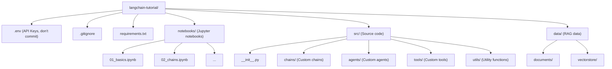

import { Aside, Tabs, TabItem, Steps } from '@astrojs/starlight/components';

## ความต้องการของระบบ

ก่อนเริ่มต้น ให้ตรวจสอบว่าคุณมีสิ่งเหล่านี้:

| รายการ | เวอร์ชันขั้นต่ำ | หมายเหตุ |
|--------|---------------|----------|
| Python | 3.10+ | แนะนำ 3.12 |
| pip | 23.0+ | Python package manager |
| Node.js | 18+ | (ถ้าใช้ LangServe) |
| Git | 2.0+ | สำหรับ version control |

## Version Baseline (Release 2026-02-13)

เพื่อให้ผลลัพธ์ของตัวอย่างในหนังสือใกล้เคียงกัน แนะนำให้ยึด baseline นี้เป็นค่าเริ่มต้น และค่อยอัปเดตเป็นรอบ

| Component | Recommended | หมายเหตุ |
| --- | --- | --- |
| Python | 3.12.x | baseline หลักของหนังสือ |
| langchain | 1.0.x | framework หลัก |
| langchain-core | 1.0.x | core abstractions |
| langgraph | 0.2.x | workflow/state graph |
| langchain-openai | 0.3.x | OpenAI integration |
| langchain-community | 0.3.x | community integrations |
| langchain-google-genai | 2.0.x | Gemini integration |
| chromadb | 0.5.x | vector store ตัวอย่าง |
| python-dotenv | 1.0.x | env management |

<Aside type="note">
  แนะนำให้ pin เวอร์ชันจริงในไฟล์ lock (เช่น `requirements.lock.txt`) แล้วให้ CI ติดตั้งจาก lock file เพื่อให้ผลลัพธ์ reproducible มากขึ้น
</Aside>

---

## การติดตั้ง Python

<Tabs>
  <TabItem label="Windows">
    ```bash
    # ดาวน์โหลดจาก python.org หรือใช้ winget
    winget install Python.Python.3.12

    # ตรวจสอบเวอร์ชัน
    python --version
    ```
  </TabItem>
  <TabItem label="macOS">
    ```bash
    # ใช้ Homebrew
    brew install python@3.12

    # ตรวจสอบเวอร์ชัน
    python3 --version
    ```
  </TabItem>
  <TabItem label="Linux">
    ```bash
    # Ubuntu/Debian
    sudo apt update
    sudo apt install python3.12 python3.12-venv python3-pip

    # ตรวจสอบเวอร์ชัน
    python3 --version
    ```
  </TabItem>
</Tabs>

---

## สร้างโปรเจกต์ใหม่

<Steps>

1. **สร้างโฟลเดอร์โปรเจกต์**

   ```bash
   mkdir langchain-tutorial
   cd langchain-tutorial
   ```

2. **สร้าง Virtual Environment**

   ```bash
   # สร้าง venv
   python -m venv .venv

   # เปิดใช้งาน (Windows)
   .venv\Scripts\activate

   # เปิดใช้งาน (macOS/Linux)
   source .venv/bin/activate
   ```

3. **ติดตั้ง LangChain**

   ```bash
   # ติดตั้ง LangChain core
   pip install langchain langchain-core

   # ติดตั้ง LLM providers
   pip install langchain-openai    # สำหรับ OpenAI
   pip install langchain-google-genai  # สำหรับ Google Gemini
   pip install langchain-anthropic  # สำหรับ Anthropic Claude

   # ติดตั้ง Community packages
   pip install langchain-community
   ```

4. **สร้างไฟล์ requirements.txt**

   ```txt title="requirements.txt"
   langchain==1.0.*
   langchain-core==1.0.*
   langchain-openai==0.3.*
   langchain-community==0.3.*
   langchain-google-genai==2.0.*
   python-dotenv==1.0.*
   chromadb==0.5.*
   langgraph==0.2.*
   ```

   ```bash
   # สร้าง lock file สำหรับ release build
   pip freeze > requirements.lock.txt

   # ติดตั้งแบบ lock เพื่อให้ผลลัพธ์เหมือนกันทุกเครื่อง
   pip install -r requirements.lock.txt
   ```

</Steps>

---

## การตั้งค่า API Keys

### รับ API Key จาก OpenAI

<Steps>

1. ไปที่ [platform.openai.com](https://platform.openai.com/)
2. สมัครบัญชีหรือเข้าสู่ระบบ
3. ไปที่ **API Keys** → **Create new secret key**
4. Copy key ที่ได้ (เริ่มต้นด้วย `sk-`)

</Steps>

### รับ API Key จาก Google AI

<Steps>

1. ไปที่ [aistudio.google.com](https://aistudio.google.com/)
2. เข้าสู่ระบบด้วย Google Account
3. คลิก **Get API key** → **Create API key**
4. Copy key ที่ได้

</Steps>

### จัดเก็บ API Key อย่างปลอดภัย

สร้างไฟล์ `.env` ในโฟลเดอร์โปรเจกต์:

```bash title=".env"
# OpenAI
OPENAI_API_KEY=sk-xxxxxxxxxxxxxxxxxxxxxxxx

# Google AI
GOOGLE_API_KEY=AIzaxxxxxxxxxxxxxxxxxxxxxxxx

# Anthropic (ถ้าใช้)
ANTHROPIC_API_KEY=sk-ant-xxxxxxxxxxxxxxxx

# LangSmith (สำหรับ monitoring)
LANGSMITH_API_KEY=lsv2_xxxxxxxxxxxxxxxx
LANGSMITH_TRACING=true
LANGSMITH_PROJECT=langchain-tutorial
```

<Aside type="caution" title="⚠️ สำคัญมาก!">
  **อย่า commit ไฟล์ `.env` ขึ้น Git!** ให้เพิ่ม `.env` ในไฟล์ `.gitignore` เสมอ เพื่อป้องกัน API Key รั่วไหล
</Aside>

### โหลด API Key ในโค้ด Python

คำอธิบาย: โค้ดตัวอย่างด้านล่างแสดงวิธีใช้งานด้วย Python ตามหัวข้อนี้แบบทีละขั้นตอน

```python title="main.py"
import os
from dotenv import load_dotenv

# โหลดค่าจากไฟล์ .env
load_dotenv()

# ตรวจสอบว่า API Key ถูกโหลดแล้ว
api_key = os.getenv("OPENAI_API_KEY")
if api_key:
    print("✅ API Key loaded successfully!")
else:
    print("❌ API Key not found. Check your .env file.")
```

---

## ทดสอบการติดตั้ง

### ทดสอบกับ OpenAI

คำอธิบาย: โค้ดตัวอย่างด้านล่างแสดงวิธีใช้งานด้วย Python ตามหัวข้อนี้แบบทีละขั้นตอน

```python title="test_openai.py"
from langchain_openai import ChatOpenAI

# สร้าง Chat Model
llm = ChatOpenAI(model="gpt-4o-mini", temperature=0)

# ทดสอบเรียกใช้
response = llm.invoke("สวัสดี! ช่วยแนะนำตัวหน่อย")
print(response.content)
```

**ผลลัพธ์ตัวอย่าง:**
```
สวัสดีครับ! ผมเป็น AI Assistant ที่พัฒนาโดย OpenAI
พร้อมช่วยเหลือคุณในหลายเรื่อง ไม่ว่าจะเป็นการตอบคำถาม
เขียนโค้ด แปลภาษา หรือให้คำแนะนำต่างๆ ครับ
```

### ทดสอบกับ Google Gemini

คำอธิบาย: โค้ดตัวอย่างด้านล่างแสดงวิธีใช้งานด้วย Python ตามหัวข้อนี้แบบทีละขั้นตอน

```python title="test_gemini.py"
from langchain_google_genai import ChatGoogleGenerativeAI

# สร้าง Chat Model
llm = ChatGoogleGenerativeAI(model="gemini-2.0-flash")

# ทดสอบเรียกใช้
response = llm.invoke("สวัสดี! ช่วยแนะนำตัวหน่อย")
print(response.content)
```

<Aside type="tip">
  หากคุณต้องการประหยัดค่าใช้จ่าย แนะนำให้ใช้ **Google Gemini** เป็นหลักในการเรียนรู้ เพราะมี free tier ที่เพียงพอสำหรับการทดลอง
</Aside>

---

## โครงสร้างโปรเจกต์แนะนำ

คำอธิบาย: แผนภาพด้านล่างสรุปโฟลว์การทำงานให้เห็นภาพรวมของหัวข้อนี้อย่างชัดเจน



---

## เครื่องมือพัฒนาที่แนะนำ

| เครื่องมือ | ประเภท | เหตุผล |
|-----------|--------|--------|
| **VS Code** | Code Editor | Extension มากมาย, Python support ดี |
| **Jupyter Notebook** | Interactive Coding | เหมาะสำหรับทดลองโค้ด LLM |
| **LangSmith** | Monitoring | Debug และ trace LLM calls |
| **Postman** | API Testing | ทดสอบ API endpoints |

### VS Code Extensions ที่แนะนำ

คำอธิบาย: ตัวอย่างคอนฟิกด้านล่างคือรูปแบบที่แนะนำให้ใช้ในหัวข้อนี้

```json title=".vscode/extensions.json"
{
  "recommendations": [
    "ms-python.python",
    "ms-python.vscode-pylance",
    "ms-toolsai.jupyter",
    "charliermarsh.ruff",
    "github.copilot"
  ]
}
```

---

:::note[พร้อมแล้ว! ✅]
สภาพแวดล้อมพร้อมแล้ว ไปต่อที่ **[บทที่ 3: Components หลักของ LangChain](/01-foundations/03-core-components/)** เพื่อเรียนรู้ส่วนประกอบสำคัญ!
:::
