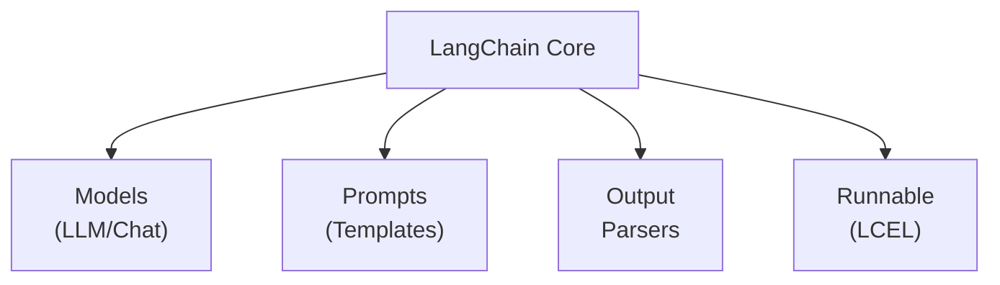

import { Aside, Tabs, TabItem, Card, CardGrid } from '@astrojs/starlight/components';

## ภาพรวม Core Components

LangChain ประกอบด้วย components หลักที่ทำงานร่วมกัน:



---

## 1. Language Models

LangChain รองรับ 2 ประเภทหลัก:

### LLMs (Text Completion)

LLMs รับ **string** เข้าและส่ง **string** ออก:

```python
from langchain_openai import OpenAI

# Text completion model
llm = OpenAI(model="gpt-3.5-turbo-instruct")
result = llm.invoke("กรุงเทพมหานครเป็นเมืองหลวงของ")
print(result)
# ประเทศไทย ตั้งอยู่ริมแม่น้ำเจ้าพระยา...
```

### Chat Models (แนะนำ ✅)

Chat Models รับ **messages** เข้าและส่ง **message** ออก — เป็นแนวทางที่ใช้งานทั่วไป:

```python
from langchain_openai import ChatOpenAI
from langchain_core.messages import HumanMessage, SystemMessage

# สร้าง Chat Model
chat = ChatOpenAI(
    model="gpt-4o-mini",
    temperature=0.7,     # ความสร้างสรรค์ (0=เป๊ะ, 1=สร้างสรรค์)
    max_tokens=1000,     # จำนวนคำสูงสุดในคำตอบ
)

# ส่ง messages
messages = [
    SystemMessage(content="คุณเป็นผู้เชี่ยวชาญด้าน Python"),
    HumanMessage(content="อธิบาย List Comprehension ให้หน่อย")
]

response = chat.invoke(messages)
print(response.content)
```

<Aside type="tip">
  **Chat Models เป็นมาตรฐาน** ในปัจจุบัน LangChain แนะนำให้ใช้ Chat Models เป็นหลัก เพราะรองรับ features ต่างๆ ได้ครบถ้วนกว่า เช่น Tool Calling, structured output
</Aside>

### เปรียบเทียบ LLM Providers

| Provider | Model | ราคา | จุดเด่น |
|----------|-------|------|---------|
| **OpenAI** | gpt-4o-mini | ถูก | เร็ว, อเนกประสงค์ |
| **OpenAI** | gpt-4o | ปานกลาง | ฉลาดมาก, multimodal |
| **Google** | gemini-2.0-flash | ฟรี-ถูก | เร็ว, context ยาว |
| **Anthropic** | claude-3.5-sonnet | ปานกลาง | เก่งเรื่องโค้ด |
| **Meta** | llama-3.1 | ฟรี (self-host) | Open source |

---

## 2. Messages

ระบบ Messages เป็นหัวใจของ Chat Models:

```python
from langchain_core.messages import (
    SystemMessage,    # กำหนดบทบาท/บุคลิก AI
    HumanMessage,     # ข้อความจากผู้ใช้
    AIMessage,        # คำตอบจาก AI
    ToolMessage,      # ผลลัพธ์จาก Tool
)
```

### ประเภทของ Messages

คำอธิบาย: โค้ดตัวอย่างด้านล่างแสดงวิธีใช้งานด้วย Python ตามหัวข้อนี้แบบทีละขั้นตอน

```python
messages = [
    # 1. SystemMessage - กำหนดบทบาท
    SystemMessage(content="""
        คุณเป็นผู้เชี่ยวชาญการทำอาหารไทย
        ตอบเป็นภาษาไทย ให้สูตรละเอียด
    """),

    # 2. HumanMessage - คำถามจากผู้ใช้
    HumanMessage(content="สูตรผัดไทยทำยังไง?"),

    # 3. AIMessage - คำตอบก่อนหน้า (สำหรับ context)
    AIMessage(content="ผัดไทยต้องใช้เส้นจันท์..."),

    # 4. HumanMessage - คำถามต่อเนื่อง
    HumanMessage(content="ถ้าไม่มีเส้นจันท์ ใช้อะไรแทนได้?"),
]

response = chat.invoke(messages)
```

<Aside type="note">
  **SystemMessage** สำคัญมาก! เป็นตัวกำหนดว่า AI จะตอบในรูปแบบไหน เหมาะกับการสร้าง persona ให้ chatbot
</Aside>

---

## 3. Prompt Templates

Prompt Templates ช่วยสร้าง prompts แบบ dynamic:

### ChatPromptTemplate (แนะนำ)

คำอธิบาย: โค้ดตัวอย่างด้านล่างแสดงวิธีใช้งานด้วย Python ตามหัวข้อนี้แบบทีละขั้นตอน

```python
from langchain_core.prompts import ChatPromptTemplate

# สร้าง template
prompt = ChatPromptTemplate.from_messages([
    ("system", "คุณเป็นผู้เชี่ยวชาญด้าน {topic}"),
    ("human", "{question}"),
])

# ใช้งาน template
messages = prompt.invoke({
    "topic": "Machine Learning",
    "question": "Neural Network คืออะไร?"
})

# ส่งไปยัง LLM
response = chat.invoke(messages)
print(response.content)
```

### PromptTemplate (สำหรับ text)

คำอธิบาย: โค้ดตัวอย่างด้านล่างแสดงวิธีใช้งานด้วย Python ตามหัวข้อนี้แบบทีละขั้นตอน

```python
from langchain_core.prompts import PromptTemplate

# สร้าง template
template = PromptTemplate.from_template("""
แปลข้อความต่อไปนี้จาก {source_lang} เป็น {target_lang}:

ข้อความ: {text}

คำแปล:
""")

# ใช้งาน
result = template.invoke({
    "source_lang": "อังกฤษ",
    "target_lang": "ไทย",
    "text": "Hello, how are you?"
})

print(result.text)
```

---

## 4. Output Parsers

Output Parsers ช่วยแปลงคำตอบจาก LLM ให้เป็นรูปแบบที่ต้องการ:

### StrOutputParser

คำอธิบาย: โค้ดตัวอย่างด้านล่างแสดงวิธีใช้งานด้วย Python ตามหัวข้อนี้แบบทีละขั้นตอน

```python
from langchain_core.output_parsers import StrOutputParser

# แปลง AIMessage เป็น string
parser = StrOutputParser()

# ใช้กับ chain (จะเรียนเพิ่มในบทที่ 5)
chain = prompt | chat | parser
result = chain.invoke({"topic": "Python", "question": "Lambda คืออะไร?"})
print(result)  # ได้ string โดยตรง
```

### JsonOutputParser

คำอธิบาย: โค้ดตัวอย่างด้านล่างแสดงวิธีใช้งานด้วย Python ตามหัวข้อนี้แบบทีละขั้นตอน

```python
from langchain_core.output_parsers import JsonOutputParser
from pydantic import BaseModel, Field

# กำหนดโครงสร้างข้อมูลที่ต้องการ
class Recipe(BaseModel):
    name: str = Field(description="ชื่อเมนู")
    ingredients: list[str] = Field(description="วัตถุดิบ")
    cooking_time: int = Field(description="เวลาทำ (นาที)")

# สร้าง parser
parser = JsonOutputParser(pydantic_object=Recipe)

# สร้าง prompt ที่บอก format
prompt = ChatPromptTemplate.from_messages([
    ("system", "คุณเป็นเชฟอาหารไทย ตอบในรูปแบบ JSON\n{format_instructions}"),
    ("human", "สูตร {dish}"),
])

# ดึง format instructions
prompt_with_format = prompt.partial(
    format_instructions=parser.get_format_instructions()
)

chain = prompt_with_format | chat | parser
result = chain.invoke({"dish": "ต้มยำกุ้ง"})
print(result)
# {'name': 'ต้มยำกุ้ง', 'ingredients': [...], 'cooking_time': 30}
```

---

## 5. Structured Output (with_structured_output)

วิธีที่ง่ายและน่าเชื่อถือที่สุดในการได้ structured data:

```python
from pydantic import BaseModel, Field
from langchain_openai import ChatOpenAI

class MovieReview(BaseModel):
    """รีวิวภาพยนตร์"""
    title: str = Field(description="ชื่อภาพยนตร์")
    rating: float = Field(description="คะแนน 1-10")
    summary: str = Field(description="สรุปสั้นๆ")
    recommend: bool = Field(description="แนะนำหรือไม่")

# ใช้ with_structured_output
llm = ChatOpenAI(model="gpt-4o-mini")
structured_llm = llm.with_structured_output(MovieReview)

result = structured_llm.invoke("รีวิวหนัง Inception ให้หน่อย")
print(f"ชื่อ: {result.title}")
print(f"คะแนน: {result.rating}/10")
print(f"สรุป: {result.summary}")
print(f"แนะนำ: {'✅' if result.recommend else '❌'}")
```

<Aside type="tip">
  `with_structured_output()` เป็นวิธีที่ **แนะนำ** ที่สุดสำหรับ structured output เพราะใช้ **Tool Calling** ภายใน ทำให้ได้ผลลัพธ์ที่น่าเชื่อถือกว่า JSON parsing
</Aside>

---

## 6. การใช้ invoke, stream, batch

LangChain รองรับ 3 วิธีการเรียกใช้:

```python
from langchain_openai import ChatOpenAI

llm = ChatOpenAI(model="gpt-4o-mini")

# 1. invoke - เรียกครั้งเดียว รอผลลัพธ์ทั้งหมด
result = llm.invoke("สวัสดี")
print(result.content)

# 2. stream - รับผลลัพธ์ทีละส่วน (real-time)
for chunk in llm.stream("เล่านิทานสั้นๆ ให้หน่อย"):
    print(chunk.content, end="", flush=True)

# 3. batch - ส่งหลายคำถามพร้อมกัน
results = llm.batch([
    "เมืองหลวงของไทย",
    "เมืองหลวงของญี่ปุ่น",
    "เมืองหลวงของฝรั่งเศส",
])
for r in results:
    print(r.content)
```

### Async versions

คำอธิบาย: โค้ดตัวอย่างด้านล่างแสดงวิธีใช้งานด้วย Python ตามหัวข้อนี้แบบทีละขั้นตอน

```python
import asyncio

async def main():
    llm = ChatOpenAI(model="gpt-4o-mini")

    # ainvoke
    result = await llm.ainvoke("สวัสดี")
    print(result.content)

    # astream
    async for chunk in llm.astream("เล่านิทาน"):
        print(chunk.content, end="")

    # abatch
    results = await llm.abatch(["คำถาม 1", "คำถาม 2"])

asyncio.run(main())
```

---

## สรุป

<CardGrid>
  <Card title="Models" icon="laptop">
    ใช้ ChatOpenAI หรือ ChatGoogleGenerativeAI เป็นหลัก
  </Card>
  <Card title="Messages" icon="comment">
    System, Human, AI Messages สร้างบทสนทนา
  </Card>
  <Card title="Prompts" icon="document">
    ChatPromptTemplate สำหรับ dynamic prompts
  </Card>
  <Card title="Output" icon="list-format">
    StrOutputParser, JsonOutputParser, หรือ with_structured_output
  </Card>
</CardGrid>

---

:::note[ก้าวต่อไป 🚀]
เมื่อเข้าใจ Components หลักแล้ว ไปเรียนรู้รายละเอียดของ **[บทที่ 4: Prompt Templates](/02-core/01-prompts/)** กัน!
:::
