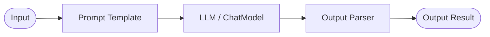
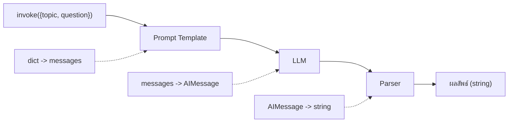

import {
  Aside,
  Tabs,
  TabItem,
  Steps,
  Card,
  CardGrid,
} from "@astrojs/starlight/components";

## LCEL คืออะไร?

**LangChain Expression Language (LCEL)** คือวิธีการสร้าง chains ใน LangChain โดยใช้ **pipe operator (`|`)** เพื่อเชื่อมต่อ components เข้าด้วยกัน

## LCEL Syntax

หัวใจของ LCEL คือเครื่องหมายท่อ (`|`) ที่ใช้ส่งต่อข้อมูลจากตัวหนึ่งไปยังอีกตัวหนึ่งเหมือน UNIX pipe



คำอธิบาย: โค้ดตัวอย่างด้านล่างแสดงวิธีใช้งานด้วย Python ตามหัวข้อนี้แบบทีละขั้นตอน

```python
chain = prompt | model | output_parser
#        ↓        ↓       ↓
#     สร้าง     ส่งให้   แปลง
#     prompt    LLM      ผลลัพธ์
```

<Aside type="note">
  LCEL เป็นวิธีมาตรฐานใน LangChain v1.0+ และเป็นแนวทางที่แนะนำแทน chain API แบบเก่า
  เช่น `LLMChain`, `SequentialChain`
</Aside>

---

## Chain แรกของคุณ

คำอธิบาย: โค้ดตัวอย่างด้านล่างแสดงวิธีใช้งานด้วย Python ตามหัวข้อนี้แบบทีละขั้นตอน

```python
from langchain_openai import ChatOpenAI
from langchain_core.prompts import ChatPromptTemplate
from langchain_core.output_parsers import StrOutputParser

# 1. สร้าง components
prompt = ChatPromptTemplate.from_messages([
    ("system", "คุณเป็นผู้เชี่ยวชาญด้าน {topic}"),
    ("human", "{question}"),
])

llm = ChatOpenAI(model="gpt-4o-mini")
parser = StrOutputParser()

# 2. สร้าง chain ด้วย LCEL
chain = prompt | llm | parser

# 3. เรียกใช้
result = chain.invoke({
    "topic": "Python",
    "question": "อธิบาย decorator ให้หน่อย"
})
print(result)
```

### การทำงานของ Chain

คำอธิบาย: แผนภาพด้านล่างสรุปโฟลว์การทำงานให้เห็นภาพรวมของหัวข้อนี้อย่างชัดเจน



---

## RunnableLambda — Custom Functions

ใส่ **function ของคุณเอง** เข้าไปใน chain:

```python
from langchain_core.runnables import RunnableLambda

# Custom function
def format_output(text: str) -> str:
    """เพิ่ม emoji และ formatting"""
    lines = text.strip().split("\n")
    formatted = []
    for i, line in enumerate(lines, 1):
        formatted.append(f"📌 {i}. {line.strip()}")
    return "\n".join(formatted)

# ใส่ใน chain
chain = prompt | llm | StrOutputParser() | RunnableLambda(format_output)
result = chain.invoke({
    "topic": "Python",
    "question": "บอก 5 library ที่ต้องรู้"
})
print(result)
# 📌 1. NumPy - สำหรับการคำนวณ
# 📌 2. Pandas - สำหรับจัดการข้อมูล
# ...
```

---

## RunnablePassthrough — ส่งต่อข้อมูล

คำอธิบาย: โค้ดตัวอย่างด้านล่างแสดงวิธีใช้งานด้วย Python ตามหัวข้อนี้แบบทีละขั้นตอน

```python
from langchain_core.runnables import RunnablePassthrough

# ส่งต่อ input โดยไม่เปลี่ยนแปลง
chain = RunnablePassthrough() | prompt | llm | parser

# assign — เพิ่มข้อมูลเข้าไปใน input
chain = RunnablePassthrough.assign(
    word_count=lambda x: len(x["text"].split())
) | prompt | llm | parser
```

### ตัวอย่าง: เพิ่มข้อมูลก่อนส่งเข้า prompt

คำอธิบาย: โค้ดตัวอย่างด้านล่างแสดงวิธีใช้งานด้วย Python ตามหัวข้อนี้แบบทีละขั้นตอน

```python
from langchain_core.runnables import RunnablePassthrough
from datetime import datetime

def add_metadata(input_dict):
    """เพิ่ม metadata เข้าไปใน input"""
    return {
        **input_dict,
        "current_date": datetime.now().strftime("%Y-%m-%d"),
        "language": "Thai",
    }

prompt = ChatPromptTemplate.from_messages([
    ("system", "วันที่: {current_date}. ตอบเป็นภาษา{language}"),
    ("human", "{question}"),
])

chain = RunnableLambda(add_metadata) | prompt | llm | parser
result = chain.invoke({"question": "ข่าวเทคโนโลยีล่าสุด?"})
```

---

## RunnableParallel — ทำงานพร้อมกัน

คำอธิบาย: โค้ดตัวอย่างด้านล่างแสดงวิธีใช้งานด้วย Python ตามหัวข้อนี้แบบทีละขั้นตอน

```python
from langchain_core.runnables import RunnableParallel

# สร้าง chains ที่ทำงานพร้อมกัน
summary_chain = summary_prompt | llm | parser
sentiment_chain = sentiment_prompt | llm | parser
keywords_chain = keywords_prompt | llm | parser

# รันพร้อมกัน!
parallel_chain = RunnableParallel(
    summary=summary_chain,
    sentiment=sentiment_chain,
    keywords=keywords_chain,
)

result = parallel_chain.invoke({"text": "ข้อความยาวๆ ที่ต้องวิเคราะห์..."})
print(result["summary"])
print(result["sentiment"])
print(result["keywords"])
```

### ตัวอย่าง: วิเคราะห์ข้อความหลายมิติ

คำอธิบาย: โค้ดตัวอย่างด้านล่างแสดงวิธีใช้งานด้วย Python ตามหัวข้อนี้แบบทีละขั้นตอน

```python
from langchain_core.prompts import ChatPromptTemplate
from langchain_core.runnables import RunnableParallel
from langchain_core.output_parsers import StrOutputParser
from langchain_openai import ChatOpenAI

llm = ChatOpenAI(model="gpt-4o-mini")
parser = StrOutputParser()

# 3 chains ทำงานพร้อมกัน
analyzer = RunnableParallel(
    summary=ChatPromptTemplate.from_template(
        "สรุปข้อความนี้ใน 2 ประโยค: {text}"
    ) | llm | parser,

    mood=ChatPromptTemplate.from_template(
        "วิเคราะห์อารมณ์ของข้อความ (บวก/ลบ/กลาง): {text}"
    ) | llm | parser,

    topics=ChatPromptTemplate.from_template(
        "ระบุหัวข้อหลักของข้อความ (3 หัวข้อ): {text}"
    ) | llm | parser,
)

result = analyzer.invoke({
    "text": "วันนี้ได้ลองใช้ LangChain ครั้งแรก รู้สึกตื่นเต้นมาก API ใช้งานง่ายดี"
})
print(f"📝 สรุป: {result['summary']}")
print(f"😊 อารมณ์: {result['mood']}")
print(f"🏷️ หัวข้อ: {result['topics']}")
```

---

## Branching — เลือก Chain ตามเงื่อนไข

คำอธิบาย: โค้ดตัวอย่างด้านล่างแสดงวิธีใช้งานด้วย Python ตามหัวข้อนี้แบบทีละขั้นตอน

```python
from langchain_core.runnables import RunnableBranch

# สร้าง branch ตามเงื่อนไข
branch = RunnableBranch(
    # (เงื่อนไข, chain ที่จะรัน)
    (lambda x: "แปล" in x["task"], translate_chain),
    (lambda x: "สรุป" in x["task"], summarize_chain),
    (lambda x: "วิเคราะห์" in x["task"], analyze_chain),
    # default chain (ถ้าไม่ตรงเงื่อนไขไหนเลย)
    general_chain,
)

# ใช้งาน
result = branch.invoke({"task": "แปลข้อความนี้", "text": "Hello World"})
```

---

## Streaming — รับผลลัพธ์แบบ Real-time

คำอธิบาย: โค้ดตัวอย่างด้านล่างแสดงวิธีใช้งานด้วย Python ตามหัวข้อนี้แบบทีละขั้นตอน

```python
chain = prompt | llm | parser

# Stream ผลลัพธ์
for chunk in chain.stream({
    "topic": "การทำอาหาร",
    "question": "สูตรผัดกะเพราหมูสับ"
}):
    print(chunk, end="", flush=True)
```

### Async Streaming

คำอธิบาย: โค้ดตัวอย่างด้านล่างแสดงวิธีใช้งานด้วย Python ตามหัวข้อนี้แบบทีละขั้นตอน

```python
import asyncio

async def stream_response():
    chain = prompt | llm | parser

    async for chunk in chain.astream({
        "topic": "Python",
        "question": "อธิบาย async/await"
    }):
        print(chunk, end="", flush=True)

asyncio.run(stream_response())
```

---

## Chain ซ้อน Chain

### Sequential Chain — ต่อเนื่อง

คำอธิบาย: โค้ดตัวอย่างด้านล่างแสดงวิธีใช้งานด้วย Python ตามหัวข้อนี้แบบทีละขั้นตอน

```python
# Chain 1: สร้างโครงร่าง
outline_prompt = ChatPromptTemplate.from_template(
    "สร้างโครงร่างบทความเรื่อง: {topic}\nเขียน 5 หัวข้อย่อย"
)
outline_chain = outline_prompt | llm | parser

# Chain 2: เขียนบทความจากโครงร่าง
article_prompt = ChatPromptTemplate.from_template(
    "เขียนบทความจากโครงร่างนี้:\n{outline}\n\nเขียนละเอียด แต่กระชับ"
)
article_chain = article_prompt | llm | parser

# รวม chain
full_chain = (
    {"outline": outline_chain, "topic": RunnablePassthrough()}
    | RunnableLambda(lambda x: {"outline": x["outline"]})
    | article_chain
)

result = full_chain.invoke({"topic": "AI ในอุตสาหกรรมอาหาร"})
```

### Pipeline Pattern (นิยมใช้ที่สุด)

คำอธิบาย: โค้ดตัวอย่างด้านล่างแสดงวิธีใช้งานด้วย Python ตามหัวข้อนี้แบบทีละขั้นตอน

```python
from langchain_core.runnables import RunnablePassthrough

# Step 1: สร้างคำถาม
generate_questions = ChatPromptTemplate.from_template(
    "จากหัวข้อ '{topic}' สร้างคำถาม 3 ข้อ"
) | llm | parser

# Step 2: ตอบคำถาม
answer_questions = ChatPromptTemplate.from_template(
    "ตอบคำถามเหล่านี้:\n{questions}"
) | llm | parser

# Step 3: สรุป
summarize = ChatPromptTemplate.from_template(
    "สรุปคำตอบทั้งหมดในย่อหน้าเดียว:\n{answers}"
) | llm | parser

# Pipeline
pipeline = (
    RunnablePassthrough.assign(questions=generate_questions)
    | RunnablePassthrough.assign(answers=answer_questions)
    | summarize
)

result = pipeline.invoke({"topic": "Quantum Computing"})
print(result)
```

---

## Error Handling — Fallback Chains

คำอธิบาย: โค้ดตัวอย่างด้านล่างแสดงวิธีใช้งานด้วย Python ตามหัวข้อนี้แบบทีละขั้นตอน

```python
from langchain_openai import ChatOpenAI

# Primary model (อาจจะแพงหรือช้า)
primary_llm = ChatOpenAI(model="gpt-4o")

# Fallback model (ถูกกว่า, เร็วกว่า)
fallback_llm = ChatOpenAI(model="gpt-4o-mini")

# สร้าง chain พร้อม fallback
chain = prompt | primary_llm.with_fallbacks([fallback_llm]) | parser

# ถ้า gpt-4o ล้มเหลว จะใช้ gpt-4o-mini แทนอัตโนมัติ
result = chain.invoke({"topic": "AI", "question": "อธิบาย Transformer"})
```

### Retry Logic

คำอธิบาย: โค้ดตัวอย่างด้านล่างแสดงวิธีใช้งานด้วย Python ตามหัวข้อนี้แบบทีละขั้นตอน

```python
# Retry สูงสุด 3 ครั้ง
chain = prompt | llm.with_retry(
    stop_after_attempt=3,
    wait_exponential_jitter=True
) | parser
```

---

## RunnableConfig — กำหนดค่าการรัน

คำอธิบาย: โค้ดตัวอย่างด้านล่างแสดงวิธีใช้งานด้วย Python ตามหัวข้อนี้แบบทีละขั้นตอน

```python
from langchain_core.runnables import RunnableConfig

config = RunnableConfig(
    max_concurrency=5,    # จำกัดการทำงานพร้อมกัน
    run_name="my-chain",  # ชื่อสำหรับ monitoring
    tags=["production"],  # tags สำหรับ LangSmith
    metadata={"user_id": "123"},
)

result = chain.invoke(input_data, config=config)
```

---

## สรุป LCEL Components

| Component             | หน้าที่              | Syntax                                 |
| --------------------- | -------------------- | -------------------------------------- |
| `\|` (pipe)           | เชื่อมต่อ components | `a \| b \| c`                          |
| `RunnableLambda`      | Custom function      | `RunnableLambda(fn)`                   |
| `RunnablePassthrough` | ส่งต่อ input         | `RunnablePassthrough()`                |
| `RunnableParallel`    | ทำงานพร้อมกัน        | `RunnableParallel(a=..., b=...)`       |
| `RunnableBranch`      | เลือกตามเงื่อนไข     | `RunnableBranch((cond, chain), ...)`   |
| `.with_fallbacks()`   | จัดการ error         | `llm.with_fallbacks([backup])`         |
| `.with_retry()`       | ลองใหม่              | `llm.with_retry(stop_after_attempt=3)` |

---

:::note[ก้าวต่อไป 🧠]
ไปเรียนรู้ **[บทที่ 6: Memory](/02-core/03-memory/)** เพื่อให้ AI จำบทสนทนาได้!
:::
