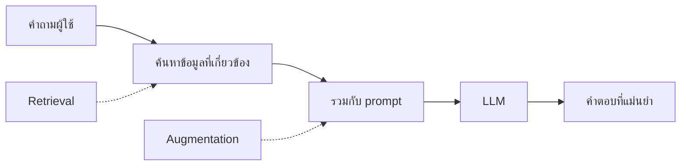
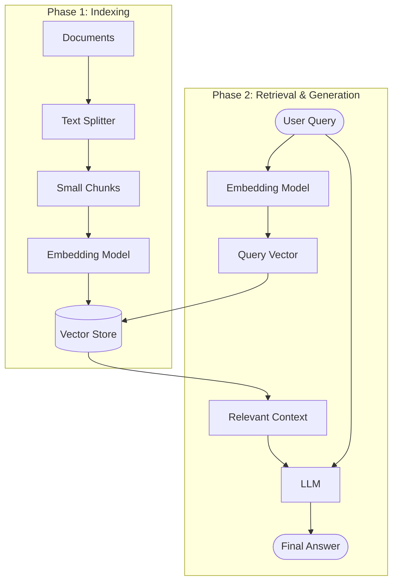

import {
  Aside,
  Tabs,
  TabItem,
  Steps,
  Card,
  CardGrid,
} from "@astrojs/starlight/components";

## RAG คืออะไร?

**Retrieval Augmented Generation (RAG)** คือเทคนิคที่ช่วยให้ LLM ตอบคำถามจาก **ข้อมูลของคุณเอง** โดยไม่ต้อง fine-tune model



### ทำไมต้อง RAG?

| ปัญหาของ LLM         | RAG แก้ได้                     |
| -------------------- | ------------------------------ |
| ข้อมูลไม่ทันสมัย     | ✅ ดึงข้อมูลล่าสุดจากฐานข้อมูล |
| ข้อมูลส่วนตัว/องค์กร | ✅ ใช้เอกสารภายในตอบได้        |
| Hallucination        | ✅ ตอบจากข้อมูลจริง มี source  |
| ค่า Fine-tuning แพง  | ✅ ไม่ต้อง fine-tune           |

---

## RAG Pipeline Overview

กระบวนการ RAG ประกอบด้วย 2 ส่วนหลักคือ **Indexing** (เตรียมข้อมูล) และ **Retrieval & Generation** (ค้นหาและตอบ)



## RAG Pipeline

<Steps>

1. **Load** — โหลดเอกสาร
2. **Split** — แบ่งเอกสารเป็นชิ้นเล็กๆ
3. **Embed** — แปลงเป็น vectors
4. **Store** — เก็บลง Vector Store
5. **Retrieve** — ค้นหาข้อมูลที่เกี่ยวข้อง
6. **Generate** — ส่งให้ LLM สร้างคำตอบ

</Steps>

---

## Step 1: Document Loaders

### โหลดจากแหล่งต่างๆ

คำอธิบาย: โค้ดตัวอย่างด้านล่างแสดงวิธีใช้งานด้วย Python ตามหัวข้อนี้แบบทีละขั้นตอน

```python
# PDF
from langchain_community.document_loaders import PyPDFLoader
docs = PyPDFLoader("report.pdf").load()

# Text file
from langchain_community.document_loaders import TextLoader
docs = TextLoader("notes.txt", encoding="utf-8").load()

# CSV
from langchain_community.document_loaders import CSVLoader
docs = CSVLoader("data.csv").load()

# Web page
from langchain_community.document_loaders import WebBaseLoader
docs = WebBaseLoader("https://example.com/article").load()

# Directory (โหลดทุกไฟล์ในโฟลเดอร์)
from langchain_community.document_loaders import DirectoryLoader
docs = DirectoryLoader("./documents/", glob="**/*.pdf").load()
```

### Document Object

คำอธิบาย: โค้ดตัวอย่างด้านล่างแสดงวิธีใช้งานด้วย Python ตามหัวข้อนี้แบบทีละขั้นตอน

```python
# แต่ละ document มีโครงสร้าง:
doc = docs[0]
print(doc.page_content)  # เนื้อหา
print(doc.metadata)      # {'source': 'report.pdf', 'page': 0}
```

---

## Step 2: Text Splitters

เอกสารยาวๆ ต้องแบ่งเป็นชิ้นเล็กๆ (chunks) เพื่อให้ค้นหาได้แม่นยำ:

```python
from langchain_text_splitters import RecursiveCharacterTextSplitter

# สร้าง text splitter
splitter = RecursiveCharacterTextSplitter(
    chunk_size=1000,       # ขนาดแต่ละ chunk (ตัวอักษร)
    chunk_overlap=200,     # ส่วนที่ซ้อนทับกัน
    separators=["\n\n", "\n", ".", " "],  # ลำดับการแบ่ง
)

# แบ่งเอกสาร
chunks = splitter.split_documents(docs)
print(f"แบ่งได้ {len(chunks)} chunks")
```

<Aside type="tip">
  **chunk_overlap** สำคัญมาก! ช่วยให้ไม่สูญเสียบริบทตรงรอยต่อของ chunks
  โดยทั่วไปใช้ 10-20% ของ chunk_size
</Aside>

### เลือก Splitter ที่เหมาะสม

| Splitter                         | เหมาะกับ             |
| -------------------------------- | -------------------- |
| `RecursiveCharacterTextSplitter` | เอกสารทั่วไป (แนะนำ) |
| `MarkdownHeaderTextSplitter`     | Markdown files       |
| `PythonCodeTextSplitter`         | Python source code   |
| `HTMLSectionSplitter`            | HTML pages           |
| `TokenTextSplitter`              | ควบคุมจำนวน tokens   |

---

## Step 3: Embeddings

**Embeddings** แปลงข้อความให้เป็น vector (ตัวเลข) เพื่อเปรียบเทียบความหมาย:

```python
from langchain_openai import OpenAIEmbeddings

# สร้าง embeddings model
embeddings = OpenAIEmbeddings(model="text-embedding-3-small")

# แปลงข้อความเป็น vector
vector = embeddings.embed_query("LangChain คืออะไร?")
print(f"มิติ: {len(vector)}")   # 1536 มิติ
print(f"ตัวอย่าง: {vector[:5]}")  # [0.012, -0.034, ...]
```

### ทางเลือก Embeddings

คำอธิบาย: โค้ดตัวอย่างด้านล่างแสดงวิธีใช้งานด้วย Python ตามหัวข้อนี้แบบทีละขั้นตอน

```python
# Google
from langchain_google_genai import GoogleGenerativeAIEmbeddings
embeddings = GoogleGenerativeAIEmbeddings(model="models/text-embedding-004")

# Hugging Face (ฟรี, รันในเครื่อง)
from langchain_huggingface import HuggingFaceEmbeddings
embeddings = HuggingFaceEmbeddings(model_name="sentence-transformers/all-MiniLM-L6-v2")
```

---

## Step 4: Vector Stores

เก็บ vectors ลงฐานข้อมูลเพื่อค้นหาแบบ semantic:

### ChromaDB (แนะนำสำหรับเริ่มต้น)

คำอธิบาย: โค้ดตัวอย่างด้านล่างแสดงวิธีใช้งานด้วย Python ตามหัวข้อนี้แบบทีละขั้นตอน

```python
from langchain_community.vectorstores import Chroma

# สร้าง vector store จาก documents
vectorstore = Chroma.from_documents(
    documents=chunks,
    embedding=embeddings,
    collection_name="my_docs",
    persist_directory="./chroma_db",  # บันทึกลง disk
)

# ค้นหา
results = vectorstore.similarity_search("LangChain คืออะไร?", k=3)
for doc in results:
    print(doc.page_content[:100])
    print(f"Source: {doc.metadata['source']}")
    print("---")
```

### FAISS (เร็วมาก, ใช้ memory)

คำอธิบาย: โค้ดตัวอย่างด้านล่างแสดงวิธีใช้งานด้วย Python ตามหัวข้อนี้แบบทีละขั้นตอน

```python
from langchain_community.vectorstores import FAISS

# สร้าง
vectorstore = FAISS.from_documents(chunks, embeddings)

# บันทึกและโหลด
vectorstore.save_local("faiss_index")
vectorstore = FAISS.load_local("faiss_index", embeddings,
                                allow_dangerous_deserialization=True)
```

---

## Step 5-6: สร้าง RAG Chain

### RAG Chain แบบสมบูรณ์

คำอธิบาย: โค้ดตัวอย่างด้านล่างแสดงวิธีใช้งานด้วย Python ตามหัวข้อนี้แบบทีละขั้นตอน

```python
from langchain_openai import ChatOpenAI, OpenAIEmbeddings
from langchain_community.vectorstores import Chroma
from langchain_core.prompts import ChatPromptTemplate
from langchain_core.output_parsers import StrOutputParser
from langchain_core.runnables import RunnablePassthrough

# 1. Setup
llm = ChatOpenAI(model="gpt-4o-mini")
embeddings = OpenAIEmbeddings(model="text-embedding-3-small")

# 2. โหลด vector store
vectorstore = Chroma(
    persist_directory="./chroma_db",
    embedding_function=embeddings,
)

# 3. สร้าง retriever
retriever = vectorstore.as_retriever(
    search_type="similarity",
    search_kwargs={"k": 4},  # ดึง 4 documents
)

# 4. RAG Prompt
prompt = ChatPromptTemplate.from_template("""
ตอบคำถามจากข้อมูลที่ให้มา ถ้าไม่มีข้อมูลให้ตอบว่า "ไม่พบข้อมูล"
อ้างอิงแหล่งที่มาเสมอ

ข้อมูลอ้างอิง:
{context}

คำถาม: {question}

คำตอบ:
""")

# 5. Helper function
def format_docs(docs):
    return "\n\n---\n\n".join(
        f"[Source: {doc.metadata.get('source', 'unknown')}]\n{doc.page_content}"
        for doc in docs
    )

# 6. สร้าง RAG Chain
rag_chain = (
    {"context": retriever | format_docs, "question": RunnablePassthrough()}
    | prompt
    | llm
    | StrOutputParser()
)

# 7. ใช้งาน!
answer = rag_chain.invoke("นโยบายการลาหยุดของบริษัทเป็นอย่างไร?")
print(answer)
```

---

## เทคนิค RAG ขั้นสูง

### 1. Multi-Query Retriever

สร้างหลายคำถามจากคำถามเดียวเพื่อค้นหาได้ครอบคลุมขึ้น:

```python
from langchain.retrievers.multi_query import MultiQueryRetriever

multi_retriever = MultiQueryRetriever.from_llm(
    retriever=vectorstore.as_retriever(),
    llm=llm,
)

# จะสร้างคำถามหลายรูปแบบอัตโนมัติ
docs = multi_retriever.invoke("ผลประกอบการปีนี้เป็นอย่างไร?")
```

### 2. Contextual Compression

บีบอัดเนื้อหาให้เหลือแต่ส่วนที่เกี่ยวข้อง:

```python
from langchain.retrievers import ContextualCompressionRetriever
from langchain.retrievers.document_compressors import LLMChainExtractor

compressor = LLMChainExtractor.from_llm(llm)
compression_retriever = ContextualCompressionRetriever(
    base_compressor=compressor,
    base_retriever=vectorstore.as_retriever(),
)

docs = compression_retriever.invoke("รายได้ Q3 เท่าไหร่?")
# ได้เฉพาะประโยคที่เกี่ยวข้องกับรายได้ Q3
```

### 3. Hybrid Search (คำค้น + Semantic)

คำอธิบาย: โค้ดตัวอย่างด้านล่างแสดงวิธีใช้งานด้วย Python ตามหัวข้อนี้แบบทีละขั้นตอน

```python
from langchain.retrievers import EnsembleRetriever
from langchain_community.retrievers import BM25Retriever

# Keyword search
bm25_retriever = BM25Retriever.from_documents(chunks)
bm25_retriever.k = 4

# Semantic search
semantic_retriever = vectorstore.as_retriever(search_kwargs={"k": 4})

# รวมทั้ง 2 แบบ
ensemble_retriever = EnsembleRetriever(
    retrievers=[bm25_retriever, semantic_retriever],
    weights=[0.3, 0.7],  # ให้น้ำหนัก semantic มากกว่า
)
```

---

## ตัวอย่าง: สร้าง PDF Q&A Bot

คำอธิบาย: โค้ดตัวอย่างด้านล่างแสดงวิธีใช้งานด้วย Python ตามหัวข้อนี้แบบทีละขั้นตอน

```python
from langchain_openai import ChatOpenAI, OpenAIEmbeddings
from langchain_community.document_loaders import PyPDFLoader
from langchain_text_splitters import RecursiveCharacterTextSplitter
from langchain_community.vectorstores import Chroma
from langchain_core.prompts import ChatPromptTemplate
from langchain_core.output_parsers import StrOutputParser
from langchain_core.runnables import RunnablePassthrough

def create_pdf_qa(pdf_path: str):
    """สร้าง Q&A bot จากไฟล์ PDF"""

    # 1. โหลดและแบ่ง PDF
    docs = PyPDFLoader(pdf_path).load()
    chunks = RecursiveCharacterTextSplitter(
        chunk_size=1000, chunk_overlap=200
    ).split_documents(docs)

    print(f"📄 โหลด {len(docs)} หน้า, แบ่งเป็น {len(chunks)} chunks")

    # 2. สร้าง Vector Store
    vectorstore = Chroma.from_documents(
        chunks, OpenAIEmbeddings(model="text-embedding-3-small")
    )

    # 3. สร้าง RAG Chain
    prompt = ChatPromptTemplate.from_template("""
    ตอบคำถามจากเอกสาร PDF ตอบเป็นภาษาไทย

    เอกสาร: {context}
    คำถาม: {question}

    คำตอบ (อ้างอิงหน้าที่พบข้อมูล):
    """)

    retriever = vectorstore.as_retriever(search_kwargs={"k": 4})

    def format_docs(docs):
        return "\n\n---\n\n".join(
            f"[Source: {doc.metadata.get('source', 'unknown')}]\n{doc.page_content}"
            for doc in docs
        )

    chain = (
        {"context": retriever | format_docs, "question": RunnablePassthrough()}
        | prompt
        | ChatOpenAI(model="gpt-4o-mini")
        | StrOutputParser()
    )

    return chain

# ใช้งาน
qa_bot = create_pdf_qa("company_handbook.pdf")
answer = qa_bot.invoke("วันลาพักร้อนมีกี่วัน?")
print(answer)
```

---

:::note[ก้าวต่อไป 🤖]
ไปเรียนรู้ **[บทที่ 8: Agents และ Tools](/03-advanced/02-agents-tools/)** เพื่อสร้าง AI ที่ตัดสินใจและทำงานได้เอง!
:::
