import {
  Aside,
  Tabs,
  TabItem,
  Steps,
  Card,
  CardGrid,
} from "@astrojs/starlight/components";

## Agent คืออะไร?

**Agent** คือ AI ที่สามารถ **ตัดสินใจ** ว่าจะใช้เครื่องมือ (Tools) อะไร เพื่อตอบคำถามหรือทำงานให้สำเร็จ

```mermaid
graph TD
    Q["คำถาม"] --> Agent["Agent (LLM)<br/>ฉันควรจะทำอะไรดี?"]
    Agent --> Search["Search Tool"]
    Agent --> Calc["Calc Tool"]
    Agent --> Code["Code Tool"]
    Search --> Agent
    Calc --> Agent
    Code --> Agent
    Agent --> Answer["คำตอบ"]

    Loop["คิด -> ทำ -> สังเกต -> คิดต่อ"] -.-> Agent
```



### ReAct Pattern (Reasoning + Acting)

ReAct (Reasoning + Acting) คือหัวใจของ Agent ยุคใหม่ โดย Agent จะวนลูปดังนี้:


1. **Thought**: คิดว่าจะทำอะไรต่อ
2. **Action**: เลือกเครื่องมือที่จะใช้
3. **Observation**: ดูผลลัพธ์จากเครื่องมือ
4. **Reason**: คิดต่อจากผลลัพธ์ที่ได้เป็นอย่างไร?
   Agent ทำงานตามลูป: **คิด → ทำ → สังเกต**

```
คำถาม: "สภาพอากาศกรุงเทพวันนี้เป็นยังไง?"

Thought: ฉันต้องค้นหาข้อมูลสภาพอากาศกรุงเทพ
Action:  search("สภาพอากาศกรุงเทพวันนี้")
Observation: อุณหภูมิ 33°C, มีเมฆบ้าง, ความชื้น 65%

Thought: ได้ข้อมูลแล้ว สรุปให้ผู้ใช้
Final Answer: วันนี้กรุงเทพอุณหภูมิ 33°C มีเมฆบ้าง ความชื้น 65%
```

---

## สร้าง Tools

### Built-in Tools

คำอธิบาย: โค้ดตัวอย่างด้านล่างแสดงวิธีใช้งานด้วย Python ตามหัวข้อนี้แบบทีละขั้นตอน

```python
# Search
from langchain_community.tools import DuckDuckGoSearchRun
search = DuckDuckGoSearchRun()

# Wikipedia
from langchain_community.tools import WikipediaQueryRun
from langchain_community.utilities import WikipediaAPIWrapper
wikipedia = WikipediaQueryRun(api_wrapper=WikipediaAPIWrapper(lang="th"))

# Python REPL (รันโค้ด Python)
from langchain_community.tools import PythonREPLTool
python_repl = PythonREPLTool()
```

### Custom Tools ด้วย @tool decorator

คำอธิบาย: โค้ดตัวอย่างด้านล่างแสดงวิธีใช้งานด้วย Python ตามหัวข้อนี้แบบทีละขั้นตอน

```python
from langchain_core.tools import tool
from datetime import datetime

@tool
def get_current_time() -> str:
    """ดึงวันที่และเวลาปัจจุบัน"""
    now = datetime.now()
    return now.strftime("%Y-%m-%d %H:%M:%S")

@tool
def calculate_bmi(weight_kg: float, height_cm: float) -> str:
    """คำนวณค่า BMI จากน้ำหนัก (กก.) และส่วนสูง (ซม.)

    Args:
        weight_kg: น้ำหนักเป็นกิโลกรัม
        height_cm: ส่วนสูงเป็นเซนติเมตร
    """
    height_m = height_cm / 100
    bmi = weight_kg / (height_m ** 2)

    if bmi < 18.5:
        category = "น้ำหนักน้อย"
    elif bmi < 25:
        category = "ปกติ"
    elif bmi < 30:
        category = "น้ำหนักเกิน"
    else:
        category = "อ้วน"

    return f"BMI = {bmi:.1f} ({category})"

# ทดสอบ
print(get_current_time.invoke({}))
print(calculate_bmi.invoke({"weight_kg": 70, "height_cm": 175}))
```

### Custom Tools ด้วย Pydantic

คำอธิบาย: โค้ดตัวอย่างด้านล่างแสดงวิธีใช้งานด้วย Python ตามหัวข้อนี้แบบทีละขั้นตอน

```python
from langchain_core.tools import StructuredTool
from pydantic import BaseModel, Field

class WeatherInput(BaseModel):
    city: str = Field(description="ชื่อเมือง")
    unit: str = Field(default="celsius", description="หน่วยอุณหภูมิ: celsius หรือ fahrenheit")

def get_weather(city: str, unit: str = "celsius") -> str:
    """ดึงข้อมูลสภาพอากาศของเมือง"""
    # ในแอพจริงจะเรียก Weather API
    return f"สภาพอากาศที่ {city}: 32°C, แดดจัด"

weather_tool = StructuredTool.from_function(
    func=get_weather,
    name="get_weather",
    description="ดึงข้อมูลสภาพอากาศของเมือง",
    args_schema=WeatherInput,
)
```

---

## Tool Calling (แนะนำ ⭐)

วิธีมาตรฐานใน LangChain v1.0+ — ใช้ความสามารถ **function calling** ของ LLM:

```python
from langchain_openai import ChatOpenAI
from langchain_core.tools import tool

@tool
def add(a: int, b: int) -> int:
    """บวกเลข 2 จำนวน"""
    return a + b

@tool
def multiply(a: int, b: int) -> int:
    """คูณเลข 2 จำนวน"""
    return a * b

# Bind tools กับ LLM
llm = ChatOpenAI(model="gpt-4o-mini")
llm_with_tools = llm.bind_tools([add, multiply])

# LLM จะ "เลือก" tool ที่เหมาะสม
response = llm_with_tools.invoke("3 + 5 เท่าไหร่?")
print(response.tool_calls)
# [{'name': 'add', 'args': {'a': 3, 'b': 5}}]

# เรียก tool ตามที่ LLM เลือก
for tool_call in response.tool_calls:
    if tool_call["name"] == "add":
        result = add.invoke(tool_call["args"])
        print(f"ผลลัพธ์: {result}")  # 8
```

---

## สร้าง Agent ด้วย create_agent

คำอธิบาย: โค้ดตัวอย่างด้านล่างแสดงวิธีใช้งานด้วย Python ตามหัวข้อนี้แบบทีละขั้นตอน

```python
from langchain_openai import ChatOpenAI
from langchain_core.tools import tool
from langchain.agents import create_agent
import ast
import operator as op

@tool
def search_web(query: str) -> str:
    """ค้นหาข้อมูลจากอินเทอร์เน็ต"""
    from langchain_community.tools import DuckDuckGoSearchRun
    return DuckDuckGoSearchRun().invoke(query)

_ALLOWED_OPS = {
    ast.Add: op.add,
    ast.Sub: op.sub,
    ast.Mult: op.mul,
    ast.Div: op.truediv,
    ast.Pow: op.pow,
    ast.USub: op.neg,
}

def safe_eval(expression: str) -> float:
    """ประเมินนิพจน์คณิตศาสตร์พื้นฐานอย่างปลอดภัย"""
    def _eval(node):
        if isinstance(node, ast.Constant) and isinstance(node.value, (int, float)):
            return node.value
        if isinstance(node, ast.BinOp) and type(node.op) in _ALLOWED_OPS:
            return _ALLOWED_OPS[type(node.op)](_eval(node.left), _eval(node.right))
        if isinstance(node, ast.UnaryOp) and type(node.op) in _ALLOWED_OPS:
            return _ALLOWED_OPS[type(node.op)](_eval(node.operand))
        raise ValueError("รองรับเฉพาะ + - * / ** และตัวเลขเท่านั้น")

    tree = ast.parse(expression, mode="eval")
    return float(_eval(tree.body))

@tool
def calculate(expression: str) -> str:
    """คำนวณนิพจน์ทางคณิตศาสตร์"""
    try:
        return str(safe_eval(expression))
    except Exception as e:
        return f"Error: {e}"

# สร้าง Agent
llm = ChatOpenAI(model="gpt-4o-mini")
tools = [search_web, calculate]

agent = create_agent(
    model=llm,
    tools=tools,
    system_prompt="คุณเป็นผู้ช่วยอัจฉริยะ ตอบเป็นภาษาไทย ใช้เครื่องมือเมื่อจำเป็น",
)

# ใช้งาน
result = agent.invoke({
    "messages": [("human", "ราคา Bitcoin วันนี้เท่าไหร่? แปลงเป็นบาทให้หน่อย")]
})

# แสดงผลลัพธ์
for message in result["messages"]:
    print(f"{message.type}: {message.content}")
```

<Aside type="note">
  `create_agent` จาก `langchain.agents` เป็นวิธีที่ **แนะนำ** ใน LangChain v1
  ส่วน `create_react_agent` จาก `langgraph` เหมาะกับงานที่ต้องควบคุม graph โดยตรง
</Aside>

---

## ตัวอย่าง Agent ขั้นสูง

### Multi-Tool Agent

คำอธิบาย: โค้ดตัวอย่างด้านล่างแสดงวิธีใช้งานด้วย Python ตามหัวข้อนี้แบบทีละขั้นตอน

```python
from langchain_openai import ChatOpenAI
from langchain_core.tools import tool
from langchain.agents import create_agent
from datetime import datetime
import json
import ast
import operator as op

@tool
def get_datetime() -> str:
    """ดึงวันที่และเวลาปัจจุบัน"""
    return datetime.now().strftime("%Y-%m-%d %H:%M:%S")

@tool
def search_knowledge(query: str) -> str:
    """ค้นหาข้อมูลจากฐานความรู้"""
    # จำลองการค้นหา (ในแอพจริงจะเชื่อม RAG)
    knowledge = {
        "python": "Python เป็นภาษาโปรแกรมยอดนิยม สร้างโดย Guido van Rossum",
        "langchain": "LangChain เป็น framework สำหรับสร้าง LLM application",
    }
    for key, value in knowledge.items():
        if key in query.lower():
            return value
    return "ไม่พบข้อมูล"

@tool
def create_todo(task: str, priority: str = "medium") -> str:
    """สร้าง todo item

    Args:
        task: รายละเอียดงาน
        priority: ระดับความสำคัญ (high/medium/low)
    """
    todo = {"task": task, "priority": priority, "status": "pending"}
    return f"✅ สร้าง todo สำเร็จ: {json.dumps(todo, ensure_ascii=False)}"

@tool
def calculate_math(expression: str) -> str:
    """คำนวณนิพจน์คณิตศาสตร์

    Args:
        expression: นิพจน์คณิตศาสตร์ เช่น "2 + 3 * 4"
    """
    try:
        result = safe_eval(expression)
        return f"ผลลัพธ์: {expression} = {result}"
    except Exception as e:
        return f"ไม่สามารถคำนวณได้: {e}"

# ใช้ safe_eval จากตัวอย่างก่อนหน้า
_ALLOWED_OPS = {
    ast.Add: op.add,
    ast.Sub: op.sub,
    ast.Mult: op.mul,
    ast.Div: op.truediv,
    ast.Pow: op.pow,
    ast.USub: op.neg,
}

def safe_eval(expression: str) -> float:
    def _eval(node):
        if isinstance(node, ast.Constant) and isinstance(node.value, (int, float)):
            return node.value
        if isinstance(node, ast.BinOp) and type(node.op) in _ALLOWED_OPS:
            return _ALLOWED_OPS[type(node.op)](_eval(node.left), _eval(node.right))
        if isinstance(node, ast.UnaryOp) and type(node.op) in _ALLOWED_OPS:
            return _ALLOWED_OPS[type(node.op)](_eval(node.operand))
        raise ValueError("รองรับเฉพาะ + - * / ** และตัวเลขเท่านั้น")

    tree = ast.parse(expression, mode="eval")
    return float(_eval(tree.body))

# สร้าง Agent
agent = create_agent(
    model=ChatOpenAI(model="gpt-4o-mini"),
    tools=[get_datetime, search_knowledge, create_todo, calculate_math],
    system_prompt="""คุณเป็น AI Assistant ที่ชาญฉลาด
    - ตอบเป็นภาษาไทย
    - ใช้เครื่องมือที่มีอยู่เมื่อต้องการข้อมูลหรือทำงาน
    - อธิบายขั้นตอนการทำงานของคุณ""",
)

# ทดสอบ
result = agent.invoke({
    "messages": [("human", "ช่วยสร้าง todo สำหรับเรียน LangChain priority high แล้วก็บอกวันที่วันนี้ด้วย")]
})
```

---

## Tool Calling กับ RAG

รวม Agent กับ RAG เพื่อสร้าง Agent ที่ค้นหาเอกสารได้:

```python
from langchain_core.tools import tool
from langchain_community.vectorstores import Chroma
from langchain_openai import OpenAIEmbeddings

# สร้าง RAG tool
@tool
def search_documents(query: str) -> str:
    """ค้นหาข้อมูลจากเอกสารของบริษัท"""
    vectorstore = Chroma(
        persist_directory="./chroma_db",
        embedding_function=OpenAIEmbeddings()
    )
    docs = vectorstore.similarity_search(query, k=3)
    return "\n\n".join(doc.page_content for doc in docs)

@tool
def search_web(query: str) -> str:
    """ค้นหาข้อมูลจากอินเทอร์เน็ต (ใช้เมื่อไม่พบในเอกสาร)"""
    from langchain_community.tools import DuckDuckGoSearchRun
    return DuckDuckGoSearchRun().invoke(query)

# Agent ที่ค้นเอกสารก่อน แล้วค่อยค้นเว็บ
agent = create_agent(
    model=ChatOpenAI(model="gpt-4o-mini"),
    tools=[search_documents, search_web],
    system_prompt="""คุณเป็นผู้ช่วยของบริษัท
    - ค้นหาจากเอกสารบริษัทก่อน
    - ถ้าไม่พบ ค่อยค้นจากอินเทอร์เน็ต
    - อ้างอิงแหล่งข้อมูลเสมอ""",
)
```

---

## Best Practices

<CardGrid>
  <Card title="📝 Tool Description สำคัญ" icon="pencil">
    เขียน description ให้ชัดเจน เพราะ LLM ใช้ตัดสินใจว่าจะเลือก tool ไหน
  </Card>
  <Card title="🛡️ Validate Input" icon="approve-check">
    ตรวจสอบ input ก่อนรัน tool ป้องกัน injection attacks
  </Card>
  <Card title="⚡ จำกัด Tools" icon="warning">
    ไม่ควรมีมากเกินไป (5-10) เพราะ LLM อาจสับสนได้
  </Card>
  <Card title="🔄 Error Handling" icon="error">
    จัดการ errors ใน tool ให้ดี return error message แทนที่จะ crash
  </Card>
</CardGrid>

---

:::note[ก้าวต่อไป 🕸️]
ไปเรียนรู้ **[บทที่ 9: LangGraph](/03-advanced/03-langgraph/)** เพื่อสร้าง Multi-Agent workflows ที่ซับซ้อน!
:::
