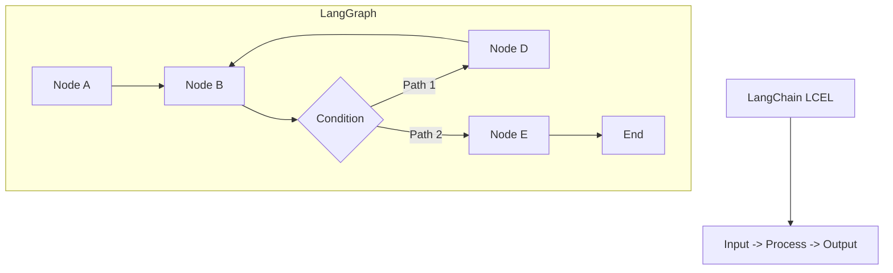
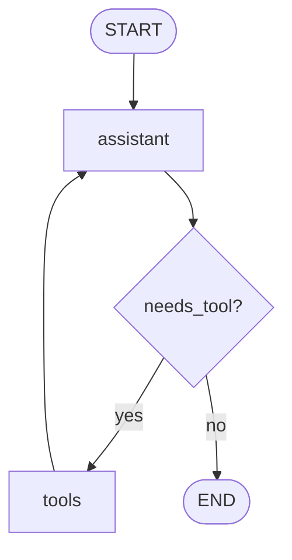
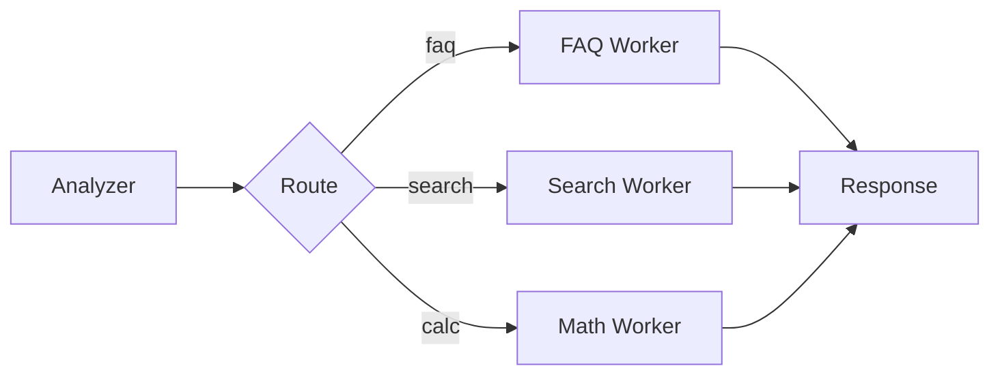
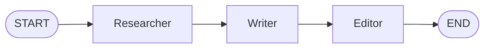

import {
  Aside,
  Steps,
} from "@astrojs/starlight/components";

## LangGraph คืออะไร?

**LangGraph** คือไลบรารีสำหรับสร้าง **AI workflow แบบมีสถานะ (stateful)** ที่ซับซ้อน โดยเหมาะกับงานที่มี:

- การวนลูป (loops)
- การแตกแขนงตามเงื่อนไข (conditional branching)
- การทำงานหลาย agent ร่วมกัน (multi-agent)
- การหยุดรอมนุษย์อนุมัติ (human-in-the-loop)

คำอธิบาย: แผนภาพด้านล่างสรุปโฟลว์การทำงานให้เห็นภาพรวมของหัวข้อนี้อย่างชัดเจน



### เมื่อไหร่ควรใช้ LangGraph?

| ใช้ LCEL | ใช้ LangGraph |
| --- | --- |
| Pipeline เส้นตรง | มี loop/branch |
| งานต่อเนื่องไม่ซับซ้อน | ต้องตัดสินใจตามเงื่อนไข |
| ไม่ต้องเก็บ state ซับซ้อน | ต้องจัดการ state หลายขั้น |
| single-agent | multi-agent |

<Aside type="tip">
ถ้าโจทย์ยังเป็น pipeline ตรงๆ ให้เริ่มด้วย LCEL ก่อน และค่อยขยับมา LangGraph เมื่อมี loop/branch/state ซับซ้อน
</Aside>

---

## Core Concepts

### 1. Graph

คำอธิบาย: โค้ดตัวอย่างด้านล่างแสดงวิธีใช้งานด้วย Python ตามหัวข้อนี้แบบทีละขั้นตอน

```python
from langgraph.graph import StateGraph

graph = StateGraph(State)
```

### 2. State

คำอธิบาย: โค้ดตัวอย่างด้านล่างแสดงวิธีใช้งานด้วย Python ตามหัวข้อนี้แบบทีละขั้นตอน

```python
from typing import TypedDict, Annotated
from langgraph.graph.message import add_messages

class State(TypedDict):
    messages: Annotated[list, add_messages]  # บทสนทนาสะสม
    current_step: str                         # ขั้นตอนปัจจุบัน
    data: dict                                # ข้อมูลธุรกิจที่ใช้ร่วมกัน
```

### 3. Node

คำอธิบาย: โค้ดตัวอย่างด้านล่างแสดงวิธีใช้งานด้วย Python ตามหัวข้อนี้แบบทีละขั้นตอน

```python
def my_node(state: State) -> dict:
    return {"current_step": "done"}
```

### 4. Edge

คำอธิบาย: โค้ดตัวอย่างด้านล่างแสดงวิธีใช้งานด้วย Python ตามหัวข้อนี้แบบทีละขั้นตอน

```python
graph.add_edge("node_a", "node_b")

graph.add_conditional_edges(
    "node_a",
    router,
    {"path_1": "node_b", "path_2": "node_c"}
)
```

### 5. START / END

คำอธิบาย: โค้ดตัวอย่างด้านล่างแสดงวิธีใช้งานด้วย Python ตามหัวข้อนี้แบบทีละขั้นตอน

```python
from langgraph.graph import START, END

graph.add_edge(START, "first_node")
graph.add_edge("last_node", END)
```

### 6. Checkpointing

คำอธิบาย: โค้ดตัวอย่างด้านล่างแสดงวิธีใช้งานด้วย Python ตามหัวข้อนี้แบบทีละขั้นตอน

```python
from langgraph.checkpoint.memory import MemorySaver

checkpointer = MemorySaver()
app = graph.compile(checkpointer=checkpointer)
```

---

## Graph แรกของคุณ

คำอธิบาย: โค้ดตัวอย่างด้านล่างแสดงวิธีใช้งานด้วย Python ตามหัวข้อนี้แบบทีละขั้นตอน

```python
from typing import TypedDict, Annotated
from langgraph.graph import StateGraph, START, END
from langgraph.graph.message import add_messages
from langchain_openai import ChatOpenAI

class State(TypedDict):
    messages: Annotated[list, add_messages]

llm = ChatOpenAI(model="gpt-4o-mini")

def chatbot(state: State):
    response = llm.invoke(state["messages"])
    return {"messages": [response]}

graph = StateGraph(State)
graph.add_node("chatbot", chatbot)
graph.add_edge(START, "chatbot")
graph.add_edge("chatbot", END)

app = graph.compile()

result = app.invoke({
    "messages": [("human", "สวัสดี! LangGraph คืออะไร?")]
})

print(result["messages"][-1].content)
```

<Aside type="note">
node function ควรคืนค่าเป็น partial state (เฉพาะ key ที่เปลี่ยน) เพื่อให้ graph merge state ต่อไปได้ง่าย
</Aside>

---

## Conditional Edges

คำอธิบาย: โค้ดตัวอย่างด้านล่างแสดงวิธีใช้งานด้วย Python ตามหัวข้อนี้แบบทีละขั้นตอน

```python
from typing import TypedDict, Annotated
from langgraph.graph import StateGraph, START, END
from langgraph.graph.message import add_messages
from langchain_core.messages import ToolMessage

class State(TypedDict):
    messages: Annotated[list, add_messages]
    needs_tool: bool

def assistant(state: State):
    response = llm_with_tools.invoke(state["messages"])
    return {
        "messages": [response],
        "needs_tool": len(response.tool_calls) > 0,
    }

def tool_executor(state: State):
    last_message = state["messages"][-1]
    outputs = []
    for tool_call in last_message.tool_calls:
        result = tool_map[tool_call["name"]].invoke(tool_call["args"])
        outputs.append(ToolMessage(content=str(result), tool_call_id=tool_call["id"]))
    return {"messages": outputs}

def router(state: State):
    return "tools" if state["needs_tool"] else "end"

graph = StateGraph(State)
graph.add_node("assistant", assistant)
graph.add_node("tools", tool_executor)

graph.add_edge(START, "assistant")
graph.add_conditional_edges("assistant", router, {"tools": "tools", "end": END})
graph.add_edge("tools", "assistant")

app = graph.compile()
```

คำอธิบาย: แผนภาพด้านล่างสรุปโฟลว์การทำงานให้เห็นภาพรวมของหัวข้อนี้อย่างชัดเจน



## Pattern: Router + Worker Nodes

โครงสร้างที่ใช้บ่อยใน production:

1. node แรกทำหน้าที่วิเคราะห์งาน
2. router ตัดสินใจเส้นทาง
3. ส่งไป worker node ที่เหมาะสม
4. รวมผลลัพธ์กลับมาตอบ



---

## Human-in-the-Loop

ให้มนุษย์อนุมัติก่อนขั้นตอนที่มีความเสี่ยง

```python
from typing import TypedDict, Annotated
from langgraph.checkpoint.memory import MemorySaver
from langgraph.graph import StateGraph, START, END
from langgraph.graph.message import add_messages
from langchain_core.messages import AIMessage

checkpointer = MemorySaver()

class State(TypedDict):
    messages: Annotated[list, add_messages]

def propose_action(state: State):
    response = llm.invoke(state["messages"])
    return {"messages": [response]}

def execute_action(state: State):
    return {"messages": [AIMessage(content="ดำเนินการเรียบร้อย")]}

graph = StateGraph(State)
graph.add_node("propose", propose_action)
graph.add_node("execute", execute_action)

graph.add_edge(START, "propose")
graph.add_edge("propose", "execute")
graph.add_edge("execute", END)

app = graph.compile(
    checkpointer=checkpointer,
    interrupt_before=["execute"],
)
```

<Aside type="caution">
ใช้ human-in-the-loop กับ action ที่มีผลกระทบสูง เช่น ลบข้อมูล โอนเงิน หรือเปลี่ยนสิทธิ์ผู้ใช้
</Aside>

---

## Multi-Agent System

คำอธิบาย: โค้ดตัวอย่างด้านล่างแสดงวิธีใช้งานด้วย Python ตามหัวข้อนี้แบบทีละขั้นตอน

```python
from typing import TypedDict, Annotated
from langgraph.graph import StateGraph, START, END
from langgraph.graph.message import add_messages
from langchain_openai import ChatOpenAI

class State(TypedDict):
    messages: Annotated[list, add_messages]
    task: str
    current_agent: str
    result: str

llm = ChatOpenAI(model="gpt-4o-mini")

def researcher(state: State):
    prompt = f"คุณเป็นนักวิจัย ค้นข้อมูลเกี่ยวกับ: {state['task']}"
    response = llm.invoke([("system", prompt)] + state["messages"])
    return {"messages": [response], "current_agent": "researcher"}

def writer(state: State):
    prompt = "คุณเป็นนักเขียน เขียนจากข้อมูลที่นักวิจัยรวบรวม"
    response = llm.invoke([("system", prompt)] + state["messages"])
    return {"messages": [response], "current_agent": "writer"}

def editor(state: State):
    prompt = "คุณเป็นบรรณาธิการ ปรับปรุงบทความให้สมบูรณ์"
    response = llm.invoke([("system", prompt)] + state["messages"])
    return {"messages": [response], "current_agent": "editor", "result": response.content}

graph = StateGraph(State)
graph.add_node("researcher", researcher)
graph.add_node("writer", writer)
graph.add_node("editor", editor)

graph.add_edge(START, "researcher")
graph.add_edge("researcher", "writer")
graph.add_edge("writer", "editor")
graph.add_edge("editor", END)

app = graph.compile()
```

คำอธิบาย: แผนภาพด้านล่างสรุปโฟลว์การทำงานให้เห็นภาพรวมของหัวข้อนี้อย่างชัดเจน



### สถาปัตยกรรม Multi-Agent ที่ใช้บ่อย

<Steps>

1. **Planner Agent** แยกงานเป็น subtasks
2. **Specialist Agents** ทำงานเฉพาะด้าน
3. **Reviewer Agent** ตรวจคุณภาพ
4. **Finalizer Agent** รวมคำตอบสุดท้าย

</Steps>

---

## Streaming กับ LangGraph

คำอธิบาย: โค้ดตัวอย่างด้านล่างแสดงวิธีใช้งานด้วย Python ตามหัวข้อนี้แบบทีละขั้นตอน

```python
for event in app.stream(
    {
        "messages": [("human", "เขียนบทความเรื่อง AI")],
        "task": "AI",
        "current_agent": "",
        "result": "",
    },
    stream_mode="values",
):
    if "current_agent" in event:
        print(f"Agent: {event['current_agent']}")
```

## Debugging และ Monitoring

แนวทางที่ควรทำในระบบจริง:

1. เก็บ input/output ของแต่ละ node
2. บันทึก route ที่ตัดสินใจในทุกคำขอ
3. วัด latency ต่อ node
4. จำกัดจำนวนรอบ loop สูงสุด

LangSmith ช่วย trace workflow และหาจุดคอขวดได้ง่ายมาก

---

## LangGraph vs LCEL

| Feature | LCEL | LangGraph |
| --- | --- | --- |
| Linear chains | เหมาะมาก | ใช้ได้แต่เกินความจำเป็น |
| Loops/Cycles | จำกัด | รองรับ |
| State management | จำกัด | ยืดหยุ่น |
| Multi-agent | ทำได้ยาก | ออกแบบมาเพื่อสิ่งนี้ |
| Human-in-the-loop | จำกัด | รองรับ |

## Best Practices

1. ออกแบบ `State` ให้เล็กและชัดเจน
2. แยก node ให้มีความรับผิดชอบเดียว
3. เขียน router ให้ deterministic
4. ใส่ timeout/retry สำหรับ node ที่เรียก API ภายนอก
5. เขียน test ทั้งระดับ node และระดับ graph

## Common Pitfalls

1. state ใหญ่เกินไปจน graph ช้า
2. loop ไม่มีเงื่อนไขจบที่ชัดเจน
3. router พึ่งข้อความอิสระมากเกินไป
4. ไม่มี error path แยกสำหรับ debug

<Aside type="tip">
เริ่มจาก LCEL ก่อน หากเจอเงื่อนไขซับซ้อน มีหลาย agent หรือมี loop ค่อยขยับมาใช้ LangGraph
</Aside>

:::note[ก้าวต่อไป]
ไปต่อที่ **[บทที่ 10: Deployment](/04-production/01-deployment/)** เพื่อเตรียมระบบสำหรับ production
:::
