import {
  Aside,
  Tabs,
  TabItem,
  Steps,
  Card,
  CardGrid,
} from "@astrojs/starlight/components";

## Production Checklist

ก่อนนำ LangChain app ขึ้น production ตรวจสอบรายการเหล่านี้:

- ✅ API Keys เก็บใน environment variables
- ✅ มี error handling ครอบคลุม
- ✅ มี rate limiting
- ✅ มี logging และ monitoring
- ✅ ทดสอบ edge cases แล้ว
- ✅ มี fallback models
- ✅ ควบคุม cost ได้

## Release Update Checklist

ใช้ checklist นี้ทุกครั้งก่อนประกาศว่าเป็น “ฉบับล่าสุด” โดยแนะนำให้ทำเป็นรอบรายเดือนหรือรายไตรมาส

1. อัปเดต baseline version ในบท setup พร้อมระบุวันที่อัปเดตล่าสุดแบบชัดเจน (เช่น `2026-02-13`)
2. รัน `npm run check:docs` เพื่อเช็ก frontmatter, code fence และ placeholder ที่ไม่ควรหลุด
3. รัน `npm run build` เพื่อยืนยันว่าเอกสาร build ผ่านครบทุกหน้า
4. ตรวจตัวอย่าง API/model ที่มีโอกาสเปลี่ยนชื่อหรือ policy แล้วปรับเนื้อหาให้ตรง
5. เปิดทบทวนบท production ทั้งบทเพื่อยืนยันว่า deployment, monitoring, testing ยังสอดคล้องกับ baseline
6. บันทึกผลการทบทวนลง `build_fix.txt` หรือ changelog ของโปรเจกต์ทุกครั้ง

<Aside type="tip">
  ถ้าทำงานเป็นทีม ให้ตั้ง CI ขั้นต่ำเป็น `npm run check && npm run build` เพื่อบังคับคุณภาพก่อน merge
</Aside>

---

## LangServe — Deploy เป็น REST API

### ติดตั้ง

คำอธิบาย: คำสั่งด้านล่างใช้รันงานและตรวจสอบผลลัพธ์ตามขั้นตอนของหัวข้อนี้

```bash
pip install langserve[all] fastapi uvicorn
```

### สร้าง API Server

คำอธิบาย: โค้ดตัวอย่างด้านล่างแสดงวิธีใช้งานด้วย Python ตามหัวข้อนี้แบบทีละขั้นตอน

```python title="server.py"
from fastapi import FastAPI
from langserve import add_routes
from langchain_openai import ChatOpenAI
from langchain_core.prompts import ChatPromptTemplate
from langchain_core.output_parsers import StrOutputParser

# สร้าง chain
prompt = ChatPromptTemplate.from_messages([
    ("system", "คุณเป็นผู้เชี่ยวชาญด้าน {topic}"),
    ("human", "{question}"),
])
llm = ChatOpenAI(model="gpt-4o-mini")
chain = prompt | llm | StrOutputParser()

# สร้าง FastAPI app
app = FastAPI(
    title="LangChain API",
    version="1.0",
    description="LangChain Powered API",
)

# เพิ่ม routes
add_routes(app, chain, path="/chat")

if __name__ == "__main__":
    import uvicorn
    uvicorn.run(app, host="0.0.0.0", port=8000)
```

คำอธิบาย: คำสั่งด้านล่างใช้รันงานและตรวจสอบผลลัพธ์ตามขั้นตอนของหัวข้อนี้

```bash
# รัน server
python server.py

# ทดสอบ
curl -X POST http://localhost:8000/chat/invoke \
  -H "Content-Type: application/json" \
  -d '{"input": {"topic": "Python", "question": "Generator คืออะไร?"}}'
```

<Aside type="tip">
  LangServe สร้าง **playground** อัตโนมัติที่
  `http://localhost:8000/chat/playground` — สะดวกมากสำหรับทดสอบ!
</Aside>

---

## Docker Deployment

### Dockerfile

คำอธิบาย: Dockerfile ด้านล่างเป็นโครงสร้างมาตรฐานสำหรับ build และ deploy ในหัวข้อนี้

```dockerfile title="Dockerfile"
FROM python:3.12-slim

WORKDIR /app

# ติดตั้ง dependencies
COPY requirements.txt .
RUN pip install --no-cache-dir -r requirements.txt

# Copy source code
COPY . .

# Expose port
EXPOSE 8000

# Run
CMD ["uvicorn", "server:app", "--host", "0.0.0.0", "--port", "8000"]
```

### docker-compose.yml

คำอธิบาย: ตัวอย่างคอนฟิกด้านล่างคือรูปแบบที่แนะนำให้ใช้ในหัวข้อนี้

```yaml title="docker-compose.yml"
version: "3.8"

services:
  langchain-api:
    build: .
    ports:
      - "8000:8000"
    environment:
      - OPENAI_API_KEY=${OPENAI_API_KEY}
      - LANGSMITH_API_KEY=${LANGSMITH_API_KEY}
      - LANGSMITH_TRACING=true
    volumes:
      - ./data:/app/data
    restart: unless-stopped

  redis:
    image: redis:7-alpine
    ports:
      - "6379:6379"
    volumes:
      - redis-data:/data

volumes:
  redis-data:
```

คำอธิบาย: คำสั่งด้านล่างใช้รันงานและตรวจสอบผลลัพธ์ตามขั้นตอนของหัวข้อนี้

```bash
# Build และรัน
docker-compose up -d

# ดู logs
docker-compose logs -f langchain-api
```

---

## LangSmith — Monitoring & Debugging

### ตั้งค่า LangSmith

คำอธิบาย: คำสั่งด้านล่างใช้รันงานและตรวจสอบผลลัพธ์ตามขั้นตอนของหัวข้อนี้

```bash title=".env"
LANGSMITH_API_KEY=lsv2_xxxxxxxxx
LANGSMITH_TRACING=true
LANGSMITH_PROJECT=my-production-app
LANGSMITH_ENDPOINT=https://api.smith.langchain.com
```

### Trace Calls

คำอธิบาย: โค้ดตัวอย่างด้านล่างแสดงวิธีใช้งานด้วย Python ตามหัวข้อนี้แบบทีละขั้นตอน

```python
from langchain_openai import ChatOpenAI
from langchain_core.prompts import ChatPromptTemplate

# ทุก call จะถูก trace อัตโนมัติเมื่อตั้งค่า LANGSMITH_TRACING=true
chain = prompt | llm | parser
result = chain.invoke(
    {"question": "สวัสดี"},
    config={"run_name": "greeting-chain"},  # ตั้งชื่อ run
)
```

### Custom Tracing

คำอธิบาย: โค้ดตัวอย่างด้านล่างแสดงวิธีใช้งานด้วย Python ตามหัวข้อนี้แบบทีละขั้นตอน

```python
from langsmith import traceable

@traceable(name="process_document")
def process_document(doc_path: str) -> str:
    """ประมวลผลเอกสาร — จะถูก trace อัตโนมัติ"""
    # ... โค้ดประมวลผล
    return result

@traceable(name="generate_response")
def generate_response(question: str, context: str) -> str:
    """สร้างคำตอบ — จะถูก trace อัตโนมัติ"""
    chain = prompt | llm | parser
    return chain.invoke({"question": question, "context": context})
```

<Aside type="note">
  LangSmith ช่วยให้เห็น request/response ของทุก LLM call, เวลาที่ใช้, token
  usage, และ cost ได้ชัดเจน
</Aside>

---

## Cost Optimization

### 1. เลือก Model ให้เหมาะสม

คำอธิบาย: โค้ดตัวอย่างด้านล่างแสดงวิธีใช้งานด้วย Python ตามหัวข้อนี้แบบทีละขั้นตอน

```python
from langchain_openai import ChatOpenAI

# งานง่าย → model ถูก
simple_llm = ChatOpenAI(model="gpt-4o-mini", temperature=0)

# งานซับซ้อน → model แพง
complex_llm = ChatOpenAI(model="gpt-4o", temperature=0)

# เลือก model ตามความซับซ้อน
def smart_route(question: str):
    if len(question) < 50 and "?" in question:
        return simple_llm  # คำถามง่าย
    return complex_llm     # คำถามซับซ้อน
```

### 2. Caching

คำอธิบาย: โค้ดตัวอย่างด้านล่างแสดงวิธีใช้งานด้วย Python ตามหัวข้อนี้แบบทีละขั้นตอน

```python
from langchain_core.globals import set_llm_cache
from langchain_community.cache import SQLiteCache

# ตั้งค่า cache
set_llm_cache(SQLiteCache(database_path=".langchain.db"))

# คำถามเดิม → ไม่เรียก API ซ้ำ
result1 = llm.invoke("Python คืออะไร?")  # เรียก API
result2 = llm.invoke("Python คืออะไร?")  # ดึงจาก cache (ฟรี!)
```

### 3. Monitor Token Usage

คำอธิบาย: โค้ดตัวอย่างด้านล่างแสดงวิธีใช้งานด้วย Python ตามหัวข้อนี้แบบทีละขั้นตอน

```python
from langchain_community.callbacks import get_openai_callback

with get_openai_callback() as cb:
    result = chain.invoke({"question": "อธิบาย AI"})

print(f"Tokens used: {cb.total_tokens}")
print(f"Prompt tokens: {cb.prompt_tokens}")
print(f"Completion tokens: {cb.completion_tokens}")
print(f"Cost: ${cb.total_cost:.4f}")
```

---

## Error Handling

### Retry และ Fallback Pattern

คำอธิบาย: โค้ดตัวอย่างด้านล่างแสดงวิธีใช้งานด้วย Python ตามหัวข้อนี้แบบทีละขั้นตอน

```python
from langchain_openai import ChatOpenAI

# Primary + Fallback
primary = ChatOpenAI(model="gpt-4o")
fallback = ChatOpenAI(model="gpt-4o-mini")

# Retry 3 ครั้ง แล้ว fallback
robust_llm = primary.with_retry(
    stop_after_attempt=3
).with_fallbacks([fallback])

# ใช้ใน chain
chain = prompt | robust_llm | parser
```

### Timeout

คำอธิบาย: โค้ดตัวอย่างด้านล่างแสดงวิธีใช้งานด้วย Python ตามหัวข้อนี้แบบทีละขั้นตอน

```python
llm = ChatOpenAI(
    model="gpt-4o-mini",
    timeout=30,       # timeout 30 วินาที
    max_retries=2,    # retry สูงสุด 2 ครั้ง
)
```

### Rate Limiting

คำอธิบาย: โค้ดตัวอย่างด้านล่างแสดงวิธีใช้งานด้วย Python ตามหัวข้อนี้แบบทีละขั้นตอน

```python
import time
from functools import wraps

def rate_limit(calls_per_minute: int):
    """จำกัดจำนวนการเรียก API"""
    interval = 60.0 / calls_per_minute
    last_call = [0]

    def decorator(func):
        @wraps(func)
        def wrapper(*args, **kwargs):
            elapsed = time.time() - last_call[0]
            if elapsed < interval:
                time.sleep(interval - elapsed)
            last_call[0] = time.time()
            return func(*args, **kwargs)
        return wrapper
    return decorator

@rate_limit(calls_per_minute=30)
def call_llm(question: str) -> str:
    return chain.invoke({"question": question})
```

---

## Testing

### Unit Testing

คำอธิบาย: โค้ดตัวอย่างด้านล่างแสดงวิธีใช้งานด้วย Python ตามหัวข้อนี้แบบทีละขั้นตอน

```python title="test_chains.py"
import pytest
from unittest.mock import patch, MagicMock
from langchain_core.messages import AIMessage

def test_chain_output():
    """ทดสอบว่า chain ให้ output ที่ถูกต้อง"""
    with patch("langchain_openai.ChatOpenAI") as mock_llm:
        mock_llm.return_value.invoke.return_value = AIMessage(
            content="Python คือภาษาโปรแกรม"
        )
        result = chain.invoke({"question": "Python คืออะไร?"})
        assert "Python" in result
        assert len(result) > 0

def test_chain_with_empty_input():
    """ทดสอบ edge case: input ว่าง"""
    result = chain.invoke({"question": ""})
    assert result is not None
```

### Integration Testing

คำอธิบาย: โค้ดตัวอย่างด้านล่างแสดงวิธีใช้งานด้วย Python ตามหัวข้อนี้แบบทีละขั้นตอน

```python
def test_rag_pipeline():
    """ทดสอบ RAG pipeline แบบ end-to-end"""
    # สร้าง test documents
    test_docs = [
        Document(page_content="LangChain เป็น framework สำหรับ LLM"),
    ]

    # สร้าง vector store
    vectorstore = Chroma.from_documents(test_docs, embeddings)
    retriever = vectorstore.as_retriever()

    # ทดสอบ retrieval
    results = retriever.invoke("LangChain คืออะไร?")
    assert len(results) > 0
    assert "LangChain" in results[0].page_content
```

---

## โครงสร้าง Production Project

คำอธิบาย: แผนภาพด้านล่างสรุปโฟลว์การทำงานให้เห็นภาพรวมของหัวข้อนี้อย่างชัดเจน

```mermaid
graph TD
    Root["my-langchain-app/"]
    Root --> Env[".env (API Keys)"]
    Root --> EnvEx[".env.example"]
    Root --> Compose["docker-compose.yml"]
    Root --> Dockerfile["Dockerfile"]
    Root --> Req["requirements.txt"]
    Root --> Pyproject["pyproject.toml"]
    Root --> Readme["README.md"]

    Root --> Src["src/"]
    Src --> SrcInit["__init__.py"]
    Src --> Server["server.py (FastAPI + LangServe)"]
    Src --> Config["config.py (Configuration)"]
    Src --> Chains["chains/"]
    Chains --> ChainsInit["__init__.py"]
    Chains --> Chat["chat.py"]
    Chains --> Rag["rag.py"]
    Src --> Agents["agents/"]
    Agents --> AgentsInit["__init__.py"]
    Agents --> Assistant["assistant.py"]
    Src --> Tools["tools/"]
    Tools --> ToolsInit["__init__.py"]
    Tools --> Custom["custom.py"]
    Src --> Utils["utils/"]
    Utils --> UtilsInit["__init__.py"]
    Utils --> Callbacks["callbacks.py"]

    Root --> Tests["tests/"]
    Tests --> TInit["__init__.py"]
    Tests --> TChains["test_chains.py"]
    Tests --> TAgents["test_agents.py"]
    Tests --> TRag["test_rag.py"]

    Root --> Data["data/"]
    Data --> Documents["documents/"]
    Data --> Vectorstore["vectorstore/"]
```



---

:::note[ก้าวต่อไป 💻]
ไปดู **[บทที่ 11: โปรเจกต์ตัวอย่าง](/04-production/02-projects/)** เพื่อสร้างโปรเจกต์จริงแบบเต็มรูป!
:::
